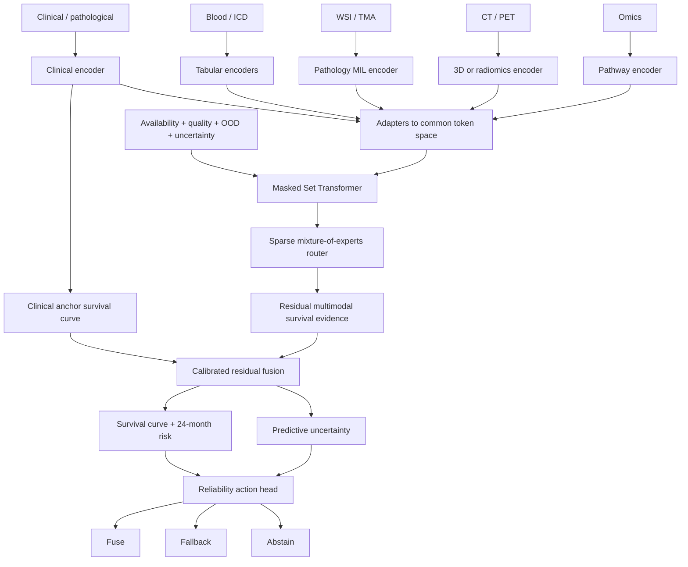

# 面向 npj Digital Medicine 的 HNSCC 任意模态缺失生存学习研究方案

> 文档日期：2026-08-12  
> 目标疾病：HNSCC（head and neck squamous cell carcinoma，头颈鳞状细胞癌）  
> 目标期刊语境：npj Digital Medicine（《自然》合作期刊数字医学）及同等级一区医学人工智能期刊  
> 基础文档：`HNSCC_deep_learning_directions_and_baseline_selection.md`、`TRUST_HN_experimental_findings_plain_language_summary.md`  
> 说明：本文件给出的是经过文献与公开数据可行性核对后的研究方案，不代表候选模型已经取得优于现有方法的实验结果，也不能保证被 npj Digital Medicine 接收。

---

## 1. 执行摘要：最推荐做什么

### 1.1 主推荐题目

**PATTERN-Surv HN：面向任意模态缺失与分布偏移的临床锚定集合式 HNSCC 生存学习**

建议英文题目：

> **Clinically anchored set-to-survival learning for head and neck squamous cell carcinoma under arbitrary missing modalities and distribution shift**

一句话研究问题：

> 对于 clinical（临床）、pathological（病理分期）、blood（血液指标）、ICD codes（国际疾病分类编码）、TMA（tissue microarray，组织芯片）、WSI（whole-slide image，全视野病理切片）、CT（计算机断层扫描）、PET（正电子发射断层扫描）和 omics（组学）并非同时存在的 HNSCC 患者，能否用一个统一的生存模型接收“任意可用模态集合”，在自然缺失、未见过的模态组合和跨中心/平台偏移下仍保持风险排序、绝对风险校准与安全失败能力？

### 1.2 推荐的直接 baseline

最直接的 HNSCC 缺失模态 baseline 是：

1. **HAF-original（Heterogeneous Aligned Fusion，异构对齐融合）**：MIDL 2026 正式会议论文的原始分类版本；
2. **HAF-Surv**：保留 HAF 对齐和融合结构，把 alive/dead（末次随访生存/死亡）分类头替换为 censored time-to-event（删失感知时间到事件）生存头；
3. **C3 / Literature-SCF（literature-derived score-level Cox fusion，文献来源的风险分数级 Cox 融合）**：来自 Tian 等 2025 年 npj Digital Medicine HNSCC 多模态论文的融合思想；
4. **Multi-FRuGaL**：2026 年 HNSCC 灵活模态组合预印本，必须明确标注为 preprint（预印本）。

其中，**HAF-Surv 是 Proposed（本文候选方法）最关键的直接方法 baseline**；C3 是最关键的高影响力期刊文献 baseline；Clinical Cox（临床 Cox 模型）是最关键的临床安全 baseline。

### 1.3 推荐模型的核心不是“更大”，而是“更安全”

拟议网络由五个关键部分组成：

1. **Modality-specific encoder（模态专属编码器）**：每种数据使用适合自己的编码器；
2. **Set-based fusion（集合式融合）**：把当前患者实际存在的模态视为一个无序集合；
3. **Clinical anchor（临床锚点）**：临床模型给出基础风险，其他模态只学习可靠的 residual evidence（残余增量证据）；
4. **Reliability-aware routing（可靠性感知路由）**：根据可用性、质量、分布外程度和不确定性决定如何融合；
5. **Fuse–fallback–abstain（融合—回退—拒绝预测）**：附加模态可靠时融合，不可靠时回退临床模型，整体输入异常时提示人工复核。

### 1.4 为什么这比“换一个 Transformer 刷 AUC”更接近目标期刊

当前实验已经说明：

- 简单直接融合、临床残差融合和风险分数后期融合都很强；
- 复杂模型没有被证明普遍优于传统模型；
- 人工删除模态容易检测，但真实 RNA-seq（RNA 测序）到 microarray（表达芯片）的平台偏移难以检测；
- 模型可以改善 C-index（一致性指数，风险排序指标），同时严重损害 calibration（校准，预测概率与真实发生率的一致程度）；
- RADCURE 的影像增益可能包含 shortcut learning（捷径学习），即利用肿瘤体积、设备或处理流程等非目标信息获得表面性能。

因此，真正有价值的问题是：

> **在数据不完整或不可靠时，模型能否保持删失感知的生存预测、知道何时不应使用某个模态，并输出可信的绝对风险或安全回退？**

---

## 2. 当前实验究竟导向了什么新问题

### 2.1 已有结论与新设计要求

| 已有实验结论 | 对新研究设计的直接要求 |
|---|---|
| 附加模态有时改善风险排序 | 新模型应保留增量信息，不能退化成“永远只用临床” |
| B5、B6、C3 已经很强 | Proposed 必须与这些简单强 baseline 比较 |
| 判别改善不等于绝对风险准确 | Uno C-index 与 IPCW Brier/calibration 必须共同报告 |
| B7 能识别人工完整模态删除 | 不能只重复 random modality dropout（随机模态丢弃） |
| B7 未可靠识别真实 RNA 平台偏移 | 必须增加显式 domain/OOD（域/分布外）建模与跨平台校准 |
| GSE65858 严重高估风险 | 必须把 ranking transport（排序迁移）与 calibration transport（校准迁移）分开 |
| RADCURE 真实影像未明显优于负对照 | 必须加入模态置换、随机嵌入和体积/中心负对照 |
| 复杂模型没有普遍胜出 | 预设止损标准；不能靠增加网络复杂度掩盖失败 |

### 2.2 不能从现有实验声称什么

当前不能声称：

- B7 或任一复杂深度模型已在所有队列达到 SOTA（state of the art，当前最佳水平）；
- 模态越多，生存预测一定越准确；
- 对人工缺失稳健，就等价于对真实世界缺失和平台漂移稳健；
- C-index 提高就代表 24 个月绝对风险可用于临床；
- RADCURE 的影像增益来自稳定的肿瘤生物学；
- 仅在完整病例上训练和测试可以代表真实临床部署。

### 2.3 中心假设

- **H1：** clinical anchor + available-modality set（临床锚点加可用模态集合）并显式输入模态质量、缺失模式和分布偏移信息，可比固定拼接或仅随机丢弃更好地适应任意模态组合。
- **H2：** full-modality teacher（完整模态教师模型）到不完整子集 student（学生模型）的蒸馏可减少缺失造成的性能下降；但必须结合不确定性和临床回退，避免错误补全放大校准偏差。
- **H3：** 将 relative risk ranking（相对风险排序）与 baseline hazard/calibration（基线风险/校准）分开迁移，比直接搬运完整生存曲线更可靠。
- **H4：** 相比强制融合，`fuse`、`fallback`、`abstain` 可在预设覆盖率下改善最差缺失模式的风险误差与校准。

---

## 3. 相关研究格局与明确空白

### 3.1 Tian 等 2025：高影响力 HNSCC 多模态预后

Tian 等在 npj Digital Medicine 的核心融合范式是：clinical、CT 和 pathology（病理）分别产生风险分数，再用 multivariable Cox model（多变量 Cox 模型）组合，属于 score-level late fusion（风险分数级后期融合）。

意义：高影响力论文不一定依赖复杂跨模态 Transformer；临床问题、独立验证、统计设计和可解释融合同样重要。当前 C3 复现的是其融合层思想，不是完整复现 3D CT 与 WSI attention-MIL（注意力多实例学习）编码器。

**空白：** 未系统解决任意模态子集、自然缺失、未见组合、模式分层校准和安全拒绝预测。

### 3.2 HAF：最直接的 HNSCC 缺失模态工作

HAF 使用 HANCOCK：

- 原始队列 763 人；701 人有 WSI；限制 WSI 与 TMA 后分析 699 人；
- living 509 人、deceased 190 人；
- patient-level 10-fold random cross-validation（患者级十折随机交叉验证）；
- 末次随访 alive/dead 二分类，主要指标 accuracy 与 AUC；
- 七模态：WSI、TMA 病理、TMA 细胞密度图、临床、病理分期、血液和 ICD；
- 病理使用 UNI + CLAM/MIL；
- SVD（奇异值分解）全局对齐；
- random-modality masking（随机模态掩蔽）和 monotonic robustness（单调稳健约束）。

**HAF 未解决：**

1. 未正确利用随访时间和删失；
2. 随机交叉验证不是官方 611/152 OOD 锁定测试；
3. 缺失主要是模拟，不等价于自然缺失机制；
4. 未把绝对风险校准作为核心目标；
5. 没有 clinical fallback 与 abstention。

所以需要同时实现 HAF-original 和公平的 **HAF-Surv**。

### 3.3 Multi-FRuGaL：必须回应的最新竞争

Multi-FRuGaL 是 2026 年 6 月发布的 HNSCC 预印本，研究任意模态子集、shared/common（共享）与 unique（独有）信息分解、redundancy-aware gating（冗余感知门控）、生存状态和复发状态分类。

因此，“HANCOCK + shared/private decomposition + gating”已经不足够新。PATTERN-Surv 必须突出：

- censored time-to-event；
- natural missingness；
- unseen missing patterns；
- cross-platform/centre shift；
- pattern-wise calibration；
- clinical anchoring；
- safe fallback/abstention；
- cross-cohort replication；
- negative controls。

截至 2026-08-12，该工作按预印本处理，不能当作正式同行评议论文。

### 3.4 DisPro：不完整病理—组学生存预测

DisPro 发表于 CVPR 2025：

- 完整模态 teacher 指导不完整 student；
- UniPro（单模态提示）蒸馏缺失模态特异知识；
- MultiPro（多模态提示）利用可见模态推断公共信息；
- 使用离散时间 hazard 和 survival probability；
- 在 BLCA、BRCA、COADREAD、LUAD、UCEC 等 TCGA 癌种验证。

可借鉴 full-to-subset distillation（完整到子集蒸馏），但不建议机械复制其大语言模型 prompt 设计。HNSCC 模态更多、异构性更强，还需处理缺失机制、平台偏移和校准。

### 3.5 邻近癌种的 npj Digital Medicine 参考

2026 年 npj Digital Medicine 的 NSCLC 缺失模态生存研究使用 clinical、PET 和 CT，以 patient-wise similarity graph（患者相似性图）、edge attention（边注意力）和 Cox partial likelihood 建模；论文报告开发队列 136 人、验证队列 49 人，仅约 37% 三模态完整。

这说明“缺失模态 + 生存预测”符合该刊方法学兴趣。但它不是 HNSCC 直接证据，也未完全解决大样本跨中心、未见模式、模式分层校准和安全回退。

### 3.6 可迁移的计算机 AI 方法

| 方法 | 可借鉴部分 | 本研究必须补充 |
|---|---|---|
| Flex-MoE（灵活专家混合） | 任意模态组合的动态专家路由 | 删失生存、校准、临床回退 |
| SimMLM | 模态感知掩蔽、已见/未见缺失模式 | HNSCC 生存和医学验证 |
| MOTCat | 不完整病理—组学 token 交互 | 更多模态、自然缺失、安全动作 |
| CLD（条件潜在分化） | 共享与特异潜在信息分离 | 不能把 shared/unique 当唯一创新 |
| Diffusion completion（扩散补全） | 多样化潜在补全和不确定性 | 防止生成患者不真实证据 |
| Active feature acquisition（主动特征获取） | 下一模态的信息价值 | 真实成本、时序和临床流程验证 |

---

## 4. 五个可行 idea 与优先级

### Idea 1：PATTERN-Surv HN——任意模态集合的临床锚定生存学习

输入任意可用模态集合，输出 OS 完整生存曲线、24 月死亡风险、RFS、预测不确定性及 `fuse/fallback/abstain`。

核心创新：删失感知的缺失模式一致训练、临床锚定残余融合、自然和未见缺失组合、模式分层校准、跨平台/中心偏移下安全回退。

公开数据：HANCOCK 主研究；RADCURE 影像复制；TCGA-HNSC + CPTAC/GEO 病理—组学复制。**主推荐。**

### Idea 2：CALIB-Bridge HN——排序与校准迁移解耦

TCGA RNA-seq 训练后迁移到 GSE65858 microarray，使用共享 ranking encoder（排序编码器）和 domain-specific calibration adapter（域特异校准适配器）；比较 zero-shot（零样本迁移）、小校准集、适配器微调和完全重训，并在组学 OOD 时回退 clinical anchor。

优点：直接解决当前最明确的 GSE65858 失败。局限：多模态广度较窄。建议作为主方案 Study 2。

### Idea 3：SHORTCUT-SAFE HN——缺失与捷径联合鲁棒影像生存

clinical anchor + CT/WSI residual evidence；输入体积、扫描/染色质量、中心和 OOD 可靠性标记；加入置换、随机、体积匹配负对照；影像不可靠时回退临床。

数据：RADCURE、TCGA-HNSC/CPTAC。优点是直接承接 RADCURE 负对照发现；局限是原始图像版本成本高。建议作为 Study 3 或独立备选。

### Idea 4：ACQUIRE-HN——成本感知动态模态获取

从 clinical 开始，学习 acquire next modality / stop / fallback（获取下一模态/停止/回退），联合优化生存误差、检查成本和覆盖率。公开数据缺少真实费用、时延和医生决策，因此只适合后续概念验证。

### Idea 5：U-Latent HN——不确定性感知潜在证据补全

不生成原始 CT/WSI，只在 latent space（潜在空间）补全 token，生成多个候选以估计 completion uncertainty（补全不确定性），高不确定时回退。技术新，但难证明补全的是患者真实生物学，推荐作为可选模块而非唯一创新。

### 4.1 评分矩阵

评分 1–5，工程成本中 5 表示成本最高。

| Idea | 临床价值 | 方法创新 | 与现有工作差异 | 公开数据可行性 | 外部验证能力 | 工程成本 | npjDM 叙事 | 推荐 |
|---|---:|---:|---:|---:|---:|---:|---:|---|
| PATTERN-Surv HN | 5 | 5 | 5 | 5 | 5 | 4 | 5 | **主推荐** |
| CALIB-Bridge HN | 5 | 4 | 5 | 4 | 5 | 3 | 4 | Study 2 |
| SHORTCUT-SAFE HN | 5 | 4 | 5 | 4 | 4 | 5 | 5 | Study 3 |
| ACQUIRE-HN | 4 | 5 | 4 | 3 | 2 | 4 | 4 | 后续扩展 |
| U-Latent HN | 3 | 5 | 3 | 4 | 3 | 5 | 3 | 可选模块 |

**决策：** 不建议并列推进五个独立课题。应以 PATTERN-Surv HN 为方法主线，把 CALIB-Bridge 和 SHORTCUT-SAFE 作为跨平台和影像复制研究，U-Latent 仅作消融模块。

---

## 5. 主推荐网络：PATTERN-Surv HN

### 5.1 临床使用场景

目标不是代替多学科诊疗，而是在统一预测时点提供：

1. 24 月及长期 OS/RFS 风险；
2. 当前预测实际使用了哪些模态；
3. 各附加模态相对临床模型提供多少增量证据；
4. 缺失或异常是否影响可信度；
5. 应使用融合结果、退回临床模型，还是转人工复核。

治疗前模型不得混入治疗后反应信息；术后模型也应单独定义 index date（预测起点）。

### 5.2 为什么使用集合式输入

固定拼接 `clinical || CT || WSI || omics` 会把真实零与缺失填充值混淆，新增/删除模态还会改变输入结构。集合式模型把患者表示为：

```text
{clinical token, blood token, CT token, ... 当前真正存在的 token}
```

每个 token 同时携带 modality identity（模态身份）、availability（可用性）、quality（质量）、domain/OOD（来源域/分布外程度）和 uncertainty（不确定性）。Set Transformer（集合 Transformer）或 permutation-invariant attention（置换不变注意力）不依赖 token 顺序，适合任意模态组合。

### 5.3 网络总图



### 5.4 模态专属编码器

#### 表格级 MVP（minimum viable product，最小可行版本）

当前 HANCOCK 已有或允许使用 clinical/pathological、blood、ICD、TMA cell density 和预提取 patient features（患者级特征）：

- clinical/pathological：FT-Transformer（表格 Transformer）或小型 MLP（多层感知机）；
- blood：带 missing mask（缺失掩码）的 MLP；
- ICD：embedding pooling（嵌入池化）或稀疏 MLP；
- TMA cell density：小型 MLP；
- 预提取患者特征：线性 adapter（适配器）映射到统一的 128 维 token。

这个 MVP 不需要下载原始 WSI/TMA，即可验证 arbitrary-set survival（任意集合生存）的核心方法。

#### 原始影像完整版

- WSI/TMA：冻结 UNI、CONCH 或 TITAN 等 foundation model（基础模型）patch embedding，再用 CLAM、attention-MIL 或 Transformer-MIL 聚合；
- CT/PET：预提取 radiomics（影像组学）或冻结 3D encoder；有足够样本和算力后才端到端微调；
- omics：先映射为 pathway activity（通路活性）或低维模块，再用稀疏 MLP/Transformer，避免在小样本上直接输入数万基因。

### 5.5 共享与模态特异表示

每个模态可生成：

- `z_shared`：不同模态可对齐的共享疾病信息；
- `z_private`：该模态独有的增量信息。

该分解不是主创新，因为 HAF、CLD 和 Multi-FRuGaL 已覆盖相似思路。本研究中：共享部分用于跨模态蒸馏，独有部分保留真实增量；当模态缺失时，只补偿可预测的共享证据，不假装恢复不可观察的独有信息。

### 5.6 临床锚定残差融合

先得到临床生存模型：

```text
S_clinical(t | x_clinical)
```

多模态分支只输出 residual log-hazard（残余对数风险）或 residual hazard evidence（残余风险证据）：

```text
log h_final(t) = log h_clinical(t) + r_available_modalities(t)
```

优势：附加模态必须证明超越临床的增量；异常时可把残差收缩为 0 直接回退；比固定权重拼接更易解释。若 clinical 也缺失，则使用 population anchor（人群锚点）或拒绝预测，不能默认临床永远完整。

### 5.7 稀疏专家路由

MoE（mixture of experts，专家混合）可设置小型专家：clinical-only、clinical+tabular、clinical+image、clinical+omics 和 general-set expert。router（路由器）输入模态身份、质量、OOD、单模态不确定性及跨模态冲突，只激活少量专家。

MoE 必须与 mean pooling（均值池化）、attention pooling（注意力池化）和单一 Set Transformer 比较；如果无稳定增益，应删除而不是保留为装饰性复杂度。

### 5.8 完整模态教师与子集学生

训练时对多模态较完整患者构建 teacher，再采样可用模态子集训练 student：

- teacher 提供风险排序、时间风险率和共享表示；
- student 逼近 teacher 的可迁移部分；
- 蒸馏强度由 teacher uncertainty 和子集信息量加权；
- 不要求所有子集预测完全相同，以免抹掉额外模态增益；
- 模态减少时 epistemic uncertainty（认知不确定性）应总体增加。

### 5.9 生存输出头

推荐主模型采用 discrete-time survival head（离散时间生存头），输出多个时间区间 hazard 并形成完整生存曲线。也实现 Deep Cox head（深度 Cox 头）作为敏感性分析。HAF-Surv 应使用与 Proposed 相同的生存头，减少损失函数差异造成的不公平比较。

### 5.10 安全动作头

阈值在 calibration set（校准集）冻结：

- **Fuse（融合）**：使用临床锚点和可靠附加证据；
- **Fallback（回退）**：附加模态不可靠，残差置零；
- **Abstain（拒绝自动预测）**：整体输入严重缺失、OOD 或冲突，提示人工复核。

必须同时报告 coverage（覆盖率），否则选择性模型可能只保留容易病例而产生虚假优势。

---

## 6. 损失函数

```text
L = L_survival
  + λ1 L_pattern_consistency
  + λ2 L_full_to_subset_distillation
  + λ3 L_cross_modal_alignment
  + λ4 L_calibration
  + λ5 L_reliability_action
  + λ6 L_missingness_shortcut_audit
  + λ7 L_uncertain_completion   # 可选
```

- `L_survival`：删失感知离散时间负对数似然或 Cox 部分似然，不能将 alive/dead 当普通分类代替完整生存。
- `L_pattern_consistency`：同一患者多个模态子集在共同证据下不应产生无理由的排序反转，但不能强制完整和单模态预测完全相同。
- `L_full_to_subset_distillation`：蒸馏 survival logits（生存输出）、共享 token 和风险排序，只在 teacher 可靠时施加强约束。
- `L_cross_modal_alignment`：对比学习、SVD 或相关性约束对齐共享信息，同时保留 private token 防止表示坍塌。
- `L_calibration`：可微 Brier 损失、校准斜率惩罚或特定时间点校准；校准层不得使用锁定测试结局。
- `L_reliability_action`：优化 selective risk（选择性风险）与 coverage penalty（覆盖率惩罚）。
- `L_missingness_shortcut_audit`：避免只根据“缺什么”预测结局；同时保留与去相关两种敏感性分析，因为真实缺失也可能有临床含义。
- `L_uncertain_completion`：只补全 latent token，不生成原始医学图像；补全不确定性高时降低权重。

---

## 7. 公开数据与可执行性

### 7.1 HANCOCK：主数据集

已审计：总患者 763；clinical/pathological/target 763；blood 692；ICD 712；TMA cell density 736；OS usable 763；deaths 213；24 月死亡 104；24 月前删失 143；recurrence yes 177；RFS event positive 303。官方 OOD 划分为 training 611、test 152。

推荐固定：train 489、calibration 122、sealed official OOD test 152。所有标准化、插补、特征选择、阈值和温度校准仅在 train/calibration 完成。

当前可执行 MVP：clinical/pathological、blood、ICD、TMA cell density、允许使用的预提取患者特征。

完整版需额外获得 WSI、raw TMA、TMA annotations 和 UNI encodings。当前工作区配置显示这些尚未取得，不能写成已经可立即运行。

### 7.2 RADCURE：影像生态复制

TCIA 页面报告约 3,346 名患者，提供 clinical、CT、肿瘤勾画和生存结局；当前本地锁定实验使用 626 人、110 个事件的测试子集。

用途：clinical+CT 任意缺失；CT 低质量/损坏；scanner/site/protocol shift（扫描仪/中心/协议偏移）；肿瘤体积和随机影像负对照；影像失效时 clinical fallback。建议先使用公开预提取 radiomics/deep features，再决定是否下载原始 CT。

### 7.3 TCGA-HNSC：病理—组学生态

可用 clinical、RNA-seq、H&E WSI、mutation/CNV 和 OS。用于 pathology+omics incomplete survival、完整 teacher 与缺失 student、自然/人工缺失和平台迁移。必须按患者合并和划分，不能把同一患者不同切片分入训练和测试。

### 7.4 CPTAC-HNSCC：潜在外部验证

约 108 个 treatment-naive tumors（未治疗肿瘤），有 proteogenomics、clinical 和部分病理资源。使用前必须审计 OS 事件、随访、clinical/WSI/omics/proteomics 交集和终点一致性。交集或事件不足时只能作为探索性 representation transport（表征迁移），不能称强外部验证。

### 7.5 GSE65858 / GSE41613

用于 TCGA RNA-seq → GEO microarray、ranking/calibration transport、OOD detection 和组学失效时 clinical fallback。它们不是主多模态数据集，但适合真实平台漂移压力测试。

### 7.6 HECKTOR

不同年份版本任务和样本数不同：2022 初版约 325 例、主要 PET/CT 分割；后续 challenge 扩展 outcome/RFS。使用时必须写清年份、版本和 outcome 获取条件。

### 7.7 推荐组合

| 研究 | 数据生态 | 目的 | 是否需原始大图像 |
|---|---|---|---|
| Study 1 | HANCOCK | 主方法、自然缺失、官方 OOD、HAF 比较 | MVP 不需要；完整版需要 |
| Study 2 | TCGA-HNSC → GEO/CPTAC | 病理—组学缺失、跨平台排序与校准 | 可先用预提取 WSI 特征 |
| Study 3 | RADCURE | 影像缺失、低质量、协议偏移、捷径负对照 | MVP 不需要原始 CT |

统一叙事不是粗暴混合队列，而是检验同一 arbitrary-set survival principle（任意集合生存原则）能否在三种多模态生态中复现。

---

## 8. Baseline 体系

### 8.1 主表必须包含

| Baseline | 中文解释 | 作用 |
|---|---|---|
| Clinical elastic-net Cox | 临床弹性网 Cox | 最低可部署基准；复杂模型必须证明增量价值 |
| Missingness-only | 仅缺失模式模型 | 检查只凭“缺什么”能否预测结局 |
| Imputation + missing indicators | 插补加缺失指示 | 最基础缺失处理 |
| Early concatenation | 早期特征拼接 | 传统固定融合 |
| Mean/attention set fusion | 均值/注意力集合融合 | 验证复杂路由是否必要 |
| Random modality dropout Transformer | 随机模态丢弃 Transformer | 常见缺失模态训练基线 |
| B5 direct fusion | 直接融合 | 当前项目强简单基线 |
| B6 clinical residual fusion | 临床残差融合 | 与临床锚定直接相关 |
| B7 reliability gate | 可靠性门控 | 现有融合/回退/拒绝框架对照 |
| C3 / Literature-SCF | 风险分数级 Cox 后期融合 | Tian 等 npjDM 融合思想 baseline |
| HAF-Surv | HAF 删失感知生存版 | **最直接 HNSCC 缺失模态 baseline** |
| Multi-FRuGaL-Surv | Multi-FRuGaL 生存适配版 | 最新 HNSCC 任意组合竞争；预印本 |
| DisPro/CLD adaptation | DisPro/CLD 生存适配 | 病理—组学强 AI baseline |
| Proposed PATTERN-Surv | 候选方法 | 待验证，不得预先声称优越 |

补充材料可放 Random Survival Forest、GBSA、XGBoost-Cox、DeepSurv、simple missing→clinical fallback、Flex-MoE adaptation、MOTCat、确定性/扩散潜在补全和 full-modality oracle teacher。

### 8.2 HAF 的公平比较

必须报告：

1. **HAF-original**：尽量遵循原论文 699 人、患者级十折、alive/dead、accuracy/AUC，以确认复现无严重偏差；
2. **HAF-Surv**：使用 `(time, event)`、相同 train/calibration/test、相同生存头和生存指标，与 Proposed 公平比较。

不能把 Proposed 的 C-index 与 HAF-original 的 alive/dead accuracy 直接比较并称优越。

### 8.3 Tian/C3 的公平表述

建议论文写：

> We implemented a literature-derived, cross-fitted score-level Cox fusion comparator inspired by Tian et al.

中文：我们实现了一个受 Tian 等工作启发、采用交叉拟合的风险分数级 Cox 融合比较模型。

不能写 “We fully reproduced the Tian et al. CT–WSI model”，因为当前 C3 没有完整复现其 3D CT 和 WSI 网络。

### 8.4 负对照

必须包括：

- Permuted modality（患者间置换模态）；
- Random embeddings（随机嵌入）；
- Clinical + tumor volume（临床加肿瘤体积）；
- Modality availability only（仅模态可用性）；
- Site/scanner/platform only（仅中心/扫描仪/平台）；
- 保留缺失率但打乱真实特征的 placebo modality（安慰剂模态）。

如果真实模态不能稳定优于结构匹配的负对照，就不能把增益解释为该模态的特异生物学信息。

---

## 9. 缺失模态与分布偏移实验

### 9.1 自然缺失

主结果应使用全部合格患者而不是只选 complete cases（完整病例）。报告各模态可用率、缺失组合人数/事件数、缺失模式与年龄/分期/中心/结局的关系、pattern-wise performance（模式分层性能）和 worst-pattern performance（最差模式性能）。

### 9.2 模拟缺失

1. **MCAR（完全随机缺失）**：随机删除模态；
2. **MAR（条件随机缺失）**：缺失概率依赖年龄、分期、中心等可见变量；
3. **MNAR proxy（非随机缺失代理场景）**：缺失概率依赖疾病严重度或潜在风险代理，只能称敏感性场景；
4. complete modality deletion（完整删除一个模态）；
5. block missingness（成组缺失）；
6. modality quality degradation（模态质量退化）；
7. missingness mechanism shift（训练和测试缺失机制变化）。

自然缺失和模拟缺失必须分开报告。

### 9.3 未见缺失组合

通过 leave-one-pattern-out（留一缺失模式外）和 leave-one-modality-combination-out（留一组合外）训练，将测试模式分为 frequent、rare、unseen（常见、罕见、未见），报告平均、最差组和 unseen-pattern regret（未见模式遗憾值）。

### 9.4 模态损坏而非空缺

应模拟：CT 噪声/重采样/分割偏移；WSI 染色/模糊/组织面积/scanner shift；RNA-seq→microarray；blood 单位变化；ICD 编码习惯变化；真实模态在患者间置换但 missing mask 仍显示可用。

这可以区分“只识别空输入”的门控与“真正识别低质量/分布偏移”的门控。

---

## 10. 三个主要研究协议

### Study 1：HANCOCK 主研究

**问题：** 官方 OOD 和自然缺失下，PATTERN-Surv 是否比 HAF-Surv、Multi-FRuGaL-Surv、C3、B6/B7 和 Clinical Cox 更稳定？

- Primary endpoint：OS time-to-event；
- Co-primary metrics：Uno C-index 与 24 月 IPCW Brier；
- Secondary endpoint：RFS time-to-event；
- 探索性 alive/dead 只用于对齐 HAF-original；
- train 489、calibration 122、sealed OOD test 152；
- 模型和阈值冻结后只评价一次锁定测试；
- 报告全体、自然缺失、完整病例、常见/罕见/未见模式、最差模式及三类安全动作。

### Study 2：TCGA-HNSC → CPTAC/GEO

**问题：** pathology/omics 缺失和 RNA 平台变化下，能否保留排序并通过少量域特异校准恢复绝对风险？

协议：TCGA 训练与患者级验证；GSE65858/GSE41613 测试平台迁移；CPTAC 事件和交集足够时增加外部测试；每个外部队列划分小 calibration subset 与 locked test；比较 zero-shot、recalibration only（仅再校准）、adapter tuning（适配器微调）、full retraining（完全重训上限）和 OOD-triggered clinical fallback。

结论应定量回答排序下降、校准下降、少量校准恢复程度、应回退的患者及不可安全迁移的组合，而非声称跨平台完全无损。

### Study 3：RADCURE 影像可靠性复制

**问题：** CT 缺失、低质量、中心/协议变化或疑似捷径时，能否避免比 Clinical Cox 更差？

先用预提取 radiomics/deep features；比较真实影像、肿瘤体积、置换和随机影像；训练 clinical anchor 与影像 residual branch；构造 missing/corrupted/OOD；评价 router 是否降低不可靠影像权重并触发 fallback。若真实影像不优于负对照，必须解释为捷径警告。

---

## 11. 指标与统计设计

### 11.1 共同主要指标

1. **Uno C-index（Uno 一致性指数）**：风险排序，越高越好；
2. **24-month IPCW Brier score（24 月逆概率删失加权 Brier 误差）**：绝对风险误差，越低越好。

将二者设为共同主要指标，避免只优化排序而牺牲绝对风险。

### 11.2 其他指标

- integrated Brier score，IBS（积分 Brier 误差）；
- time-dependent AUC（时间依赖 AUC）；
- calibration-in-the-large（总体校准偏差）；
- calibration slope（校准斜率）和 calibration curve；
- decision curve/net benefit（决策曲线/净获益），谨慎解释；
- risk–coverage curve（风险—覆盖率曲线）；
- selective Brier（选择性 Brier）；
- failure-detection AUROC（失败检测 AUROC）；
- fallback/abstention rate；
- subgroup coverage parity（亚组覆盖率均衡性）。

### 11.3 缺失稳健性指标

- worst-pattern Brier/C-index；
- macro-average over patterns（模式宏平均）；
- degradation slope（性能退化斜率）；
- unseen-pattern regret；
- oracle gap（与完整模态上限差距）；
- clinical safety regret（相对临床模型的最差损失）；
- calibration drift（校准漂移）。

### 11.4 统计原则

- 患者级划分；
- nested cross-validation 或严格 train/calibration；
- 至少 5 个 random seeds；
- 2,000 次 paired bootstrap 估计 95% CI；
- 同一患者不同模型和子集做配对比较；
- 预设 Proposed vs HAF-Surv、Multi-FRuGaL-Surv（若可实现）、C3、Clinical Cox；
- 多重比较采用 Holm correction 或 FDR；
- 报效应量和 CI，不只报 p 值；
- normalization、imputation、feature selection 仅在训练折拟合。

### 11.5 选择性预测公平比较

当 Proposed 拒绝部分患者时，必须报告：全覆盖强制预测；相同患者子集的 baseline；risk–coverage 曲线；固定 90%/80% 覆盖率比较；被拒绝患者的亚组分布。不能把 82.9% 覆盖的 Brier 与 100% 覆盖 baseline 直接比较并称更好。

---

## 12. 消融实验

至少包括：

1. 去掉 clinical anchor；
2. residual fusion 改为直接融合；
3. Set Transformer 改为 mean pooling；
4. 去掉 MoE router；
5. 去掉 quality/OOD token；
6. 去掉 full-to-subset distillation；
7. 去掉 calibration loss；
8. 去掉 fallback，只强制融合；
9. 去掉 abstain，只允许融合/回退；
10. no completion、deterministic completion、uncertain completion；
11. 只训练 MCAR、测试 MAR/MNAR proxy；
12. 只用人工缺失训练、在自然缺失测试；
13. shared-only、private-only、shared+private；
14. 参数量匹配，确保增益不是仅来自模型更大。

不同模块不必都提高平均 C-index；可能分别改善校准、最差模式、失败检测或覆盖率—风险权衡。

---

## 13. 达到一区约 10 分影响力期刊体量的最低标准

### 13.1 明显不足的版本

```text
HANCOCK + 一个 Transformer + random modality dropout + 内部随机十折 AUC
```

该设计与 HAF/Multi-FRuGaL 重叠，且缺少删失感知、外部/OOD、校准、自然缺失、未见组合、安全回退和负对照。

### 13.2 可投稿 MVP

至少包含：

1. HANCOCK 全 763 人自然缺失；
2. OS time-to-event；
3. 官方 611/152 OOD；
4. HAF-original 和 HAF-Surv；
5. C3、B5、B6、B7、Clinical Cox；
6. MCAR/MAR/MNAR proxy；
7. leave-one-pattern-out；
8. 24 月 Brier、Uno C-index、校准和 risk–coverage；
9. fuse/fallback/abstain；
10. RADCURE 表格/预提取影像复制；
11. 缺失模式与影像负对照；
12. 锁定方案、公开代码和可复现实验配置。

### 13.3 推荐完整版

在 MVP 上增加：TCGA-HNSC→GEO/CPTAC 跨平台复制；至少两种不同多模态生态；高质量预训练图像表征；Multi-FRuGaL-Surv 和 DisPro/CLD 适配；真实/模拟/未见缺失和模态损坏；calibration transport；shortcut negative controls；模式最差组与安全回退；预注册式 SAP（statistical analysis plan，统计分析计划）；代码、环境、数据字典、模型卡和失败案例。

这才形成接近 npj Digital Medicine 的完整叙事：临床问题明确、方法有创新、验证跨生态、评价不只 AUC、失败条件可解释。

---

## 14. 论文主张、止损标准与风险

### 14.1 实验成功时可主张

> PATTERN-Surv HN enables censored survival prediction from arbitrary available modality sets and improves robustness across natural missingness, unseen modality combinations and selected distribution shifts, while retaining a clinically interpretable fallback pathway.

中文：PATTERN-Surv HN 能从任意可用模态集合进行删失感知生存预测，并在自然缺失、未见组合和部分分布偏移下提高稳健性，同时保留可解释的临床回退路径。

只有数据支持时才能进一步声称：共同主要指标优于 HAF-Surv；固定覆盖率下降低最差模式 Brier；少量校准恢复外部绝对风险；路由识别了部分真实模态失效。

### 14.2 平均性能不显著提高时仍可能成立的贡献

若平均 C-index 与 C3/HAF-Surv 接近，但能够降低最差模式 Brier、改善外部校准、检出置换/低质量模态、在固定覆盖率下安全回退，仍可形成“可靠性与安全失败”论文。

### 14.3 禁止夸大

不能写：首次解决所有医学模态缺失；真实世界普遍安全；补全了患者真实缺失影像/组学；消除了所有捷径；跨平台无需再校准；可以直接指导治疗；单次公开数据实验已经证明临床有效性。

### 14.4 Go/no-go 和止损

- CPTAC 交集事件过少：降级为探索性；
- WSI/CT 无法获取：完成表格/预提取特征 MVP；
- 某模式人数或事件过少：合并为 rare pattern 或只描述；
- Proposed 在判别、Brier、最差模式、校准、失败检测和 risk–coverage 均无改善：停止堆复杂度，回到 B6 + 简单 set fusion，或转为系统 benchmark/失败分析；
- RADCURE 真实影像不优于负对照：改为 shortcut stress test，不把影像当生物标志物；
- 外部绝对风险不能通过预设小样本校准恢复：只报告排序，并明确部署必须重新估计 baseline hazard。

---

## 15. 实施路线、周期和算力

| 阶段 | 内容 | 时间估计 |
|---|---|---:|
| 0 | 冻结 OS/RFS、模态可用率、数据字典、划分和外部队列审计 | 2–3 周 |
| 1 | Clinical Cox、B5/B6/B7/C3、missingness-only、HAF-original/HAF-Surv | 3–5 周 |
| 2 | modality adapters、Set Transformer、clinical residual、蒸馏、安全动作 | 5–8 周 |
| 3 | natural/MCAR/MAR/MNAR proxy、unseen、corruption、负对照、校准 | 4–6 周 |
| 4 | RADCURE、TCGA→GEO/CPTAC 跨生态复制 | 6–10 周 |
| 5 | paired bootstrap、失败案例、模型卡、代码和论文 | 4–6 周 |

表格/预提取特征 MVP 约 4–6 个月；加入 WSI/CT 完整版约 7–10 个月，取决于数据访问、预处理和 GPU。

算力：表格 MVP 可用单张 16–24 GB GPU 或 CPU；预提取病理/CT 特征融合用 24 GB GPU；WSI patch embedding 建议 1–2 张 24–48 GB GPU 并缓存；3D CT 端到端建议 48 GB 级 GPU或梯度累积。不建议在 763 人上从零训练大基础模型。

---

## 16. 论文图表建议

1. **Figure 1：** 不同患者拥有不同模态，模型输出 fuse/fallback/abstain；
2. **Figure 2：** HANCOCK 模态共现、缺失模式人数/事件数及与中心/分期关系；
3. **Figure 3：** Clinical Cox、C3、HAF-Surv、Multi-FRuGaL-Surv、Proposed 的 C-index、Brier 和校准；
4. **Figure 4：** 模态数量下降、seen/rare/unseen、worst-pattern；自然和模拟缺失分开；
5. **Figure 5：** risk–coverage、安全动作、失败检测和代表病例；
6. **Figure 6：** TCGA→GEO/CPTAC 排序/校准迁移与 RADCURE 真实/负对照影像。

---

## 17. 最终 Specific Aims（具体研究目标）

### Aim 1

开发 PATTERN-Surv HN，在 HANCOCK 中实现自然缺失和任意模态子集下的 OS/RFS 预测，并与 HAF-Surv、Multi-FRuGaL-Surv、C3 和 Clinical Cox 比较。

### Aim 2

评价未见缺失组合、MAR/MNAR proxy、低质量模态和缺失机制变化的稳健性，建立模式分层校准与 fuse/fallback/abstain 策略。

### Aim 3

在 RADCURE 和 TCGA-HNSC→GEO/CPTAC 检验同一原则能否跨影像、病理和组学生态复现，重点评价捷径负对照、跨平台排序迁移与绝对风险再校准。

中心主张：

> 多模态生存 AI 的临床价值不应只由完整病例上的平均判别性能定义，还应由其在自然缺失、未见模态组合和分布偏移下保持校准、识别失败并安全回退的能力定义。

---

## 18. 英文术语表

| 英文术语 | 中文解释 |
|---|---|
| HNSCC | head and neck squamous cell carcinoma，头颈鳞状细胞癌 |
| OS / RFS | overall survival，总体生存 / recurrence-free survival，无复发生存 |
| time-to-event | 时间到事件，联合使用随访时间和事件状态 |
| censoring | 删失，随访结束时尚未观察到事件 |
| clinical anchor | 临床锚点，附加模态不可靠时仍可用的临床基础模型 |
| residual fusion | 残差融合，附加模态学习临床模型未解释的增量 |
| early / late fusion | 早期特征融合 / 后期预测分数融合 |
| arbitrary missing modalities | 任意模态缺失，一个或多个模态可能不可用 |
| natural / simulated missingness | 自然缺失 / 人工模拟缺失 |
| missing pattern | 缺失模式，患者有哪些模态存在或缺失的组合 |
| unseen missing pattern | 训练未出现、测试时出现的缺失组合 |
| MCAR / MAR / MNAR | 完全随机缺失 / 条件随机缺失 / 非随机缺失 |
| complete-case analysis | 完整病例分析，只使用指定模态均完整的患者 |
| missing indicator | 缺失指示变量，告诉模型某值是否缺失 |
| modality dropout | 模态丢弃，训练中随机删除整个模态 |
| set-based learning | 集合式学习，把可用模态作为无序集合 |
| permutation invariant | 置换不变，输入 token 顺序改变不影响结果 |
| token / adapter | 表征标记 / 映射不同编码器输出的适配器 |
| Set Transformer | 用注意力处理无序集合的 Transformer |
| MoE / router | mixture of experts，专家混合 / 专家选择路由器 |
| shared / private representation | 共享表征 / 模态特异表征 |
| teacher–student distillation | 教师—学生蒸馏，用完整或强模型指导不完整模型 |
| latent completion | 潜在空间补全，在特征空间估计缺失证据 |
| hallucination | 幻觉式生成，看似合理但不一定属于患者的信息 |
| survival function / hazard | 生存函数 / 风险率 |
| Cox model | Cox 比例风险模型 |
| discrete-time survival | 离散时间生存，把随访时间划分区间建模 |
| C-index / Uno C-index | 一致性指数 / 删失加权一致性指数 |
| time-dependent AUC | 时间依赖 AUC，指定时间点区分能力 |
| IPCW Brier score | 逆概率删失加权 Brier 误差，评价绝对风险 |
| calibration | 校准，预测概率与真实发生率的一致程度 |
| calibration-in-the-large / slope | 总体校准偏差 / 校准斜率 |
| discrimination | 判别能力，区分高低风险的能力 |
| distribution shift / OOD | 分布偏移 / 分布外 |
| domain adaptation | 域适配，使模型适应新中心、设备或平台 |
| ranking / calibration transport | 风险排序迁移 / 绝对风险校准迁移 |
| baseline hazard | 基线风险，生存模型的时间风险基准部分 |
| shortcut learning | 捷径学习，利用非目标但与标签相关的简单线索 |
| negative control | 负对照，理论上不含目标生物学信息的输入 |
| uncertainty / epistemic uncertainty | 不确定性 / 由知识和数据不足造成的认知不确定性 |
| fuse / fallback / abstain | 融合 / 回退 / 拒绝自动预测 |
| coverage | 覆盖率，模型愿意自动输出预测的患者比例 |
| selective prediction | 选择性预测，允许对不可靠病例不预测 |
| risk–coverage curve | 风险—覆盖率曲线 |
| worst-group performance | 最差组性能 |
| cross-fitting / OOF | 交叉拟合 / 折外预测 |
| nested cross-validation | 嵌套交叉验证，外层评价、内层调参 |
| paired bootstrap / CI | 配对自助法 / 置信区间 |
| ablation study | 消融实验，去掉模块检验贡献 |
| external validation / locked test | 外部验证 / 锁定测试 |
| preprint | 预印本，尚未完成正式同行评议 |
| foundation model | 基础模型，大规模预训练后迁移的模型 |
| WSI / TMA | 全视野病理切片 / 组织芯片 |
| MIL / CLAM | 多实例学习 / 聚类约束注意力多实例学习 |
| radiomics / omics | 影像组学 / 转录组、基因组、蛋白组等组学 |

---

## 19. 关键参考文献与资源

> 状态按 2026-08-12 核对；正式投稿前应再次核查版本、卷期、仓库和数据访问条款。

1. Tian et al. **Multimodal fusion model for prognostic prediction and radiotherapy response assessment in head and neck squamous cell carcinoma.** *npj Digital Medicine*. 2025.  
   https://www.nature.com/articles/s41746-025-01712-0

2. Zheng et al. **Heterogeneous Aligned Fusion for Survival Classification with Missing Modalities.** *Proceedings of Machine Learning Research*, MIDL 2026.  
   https://proceedings.mlr.press/v315/zheng26a.html  
   https://github.com/zz9tf/HAF

3. Xu et al. **Distilled Prompt Learning for Incomplete Multimodal Survival Prediction.** *CVPR*. 2025.  
   https://openaccess.thecvf.com/content/CVPR2025/html/Xu_Distilled_Prompt_Learning_for_Incomplete_Multimodal_Survival_Prediction_CVPR_2025_paper.html  
   https://github.com/Innse/DisPro

4. **Multimodal Flexible Redundancy-aware Decomposed Gated Learning for Head and Neck Cancer Prognosis.** arXiv preprint. 2026.  
   https://arxiv.org/abs/2606.06867

5. **Handling missing modalities in multimodal survival prediction for non-small cell lung cancer.** *npj Digital Medicine*. 2026.  
   https://www.nature.com/articles/s41746-026-02783-3

6. **A multimodal dataset for precision oncology in head and neck cancer（HANCOCK）.** *Nature Communications*. 2025.  
   https://www.nature.com/articles/s41467-025-62386-6

7. **RADCURE collection.** The Cancer Imaging Archive（TCIA）.  
   https://www.cancerimagingarchive.net/collection/radcure/

8. **TCGA-HNSC project.** Genomic Data Commons（GDC）.  
   https://portal.gdc.cancer.gov/projects/TCGA-HNSC

9. **CPTAC-HNSCC proteogenomic characterization.** *Nature Communications*. 2021.  
   https://www.nature.com/articles/s41467-021-23458-5  
   https://proteomics.cancer.gov/data-portal

10. **HECKTOR challenge and dataset.**  
    https://hecktor.grand-challenge.org/  
    https://www.nature.com/articles/s41597-022-01181-0

11. Flex-MoE，arbitrary modality combination 方法资源。  
    https://github.com/UNITES-Lab/flex-moe

12. npj Digital Medicine aims and scope（办刊范围）。  
    https://www.nature.com/npjdigitalmed/aims

---

## 20. 最终结论与最小执行起点

### 推荐选择

- **主 idea：PATTERN-Surv HN**；
- **最直接 baseline：HAF-Surv**；
- **高影响力 HNSCC 文献 baseline：C3 / Tian 式 score-level Cox fusion**；
- **最新竞争工作：Multi-FRuGaL，按预印本处理**；
- **跨平台子研究：CALIB-Bridge HN**；
- **影像可靠性子研究：SHORTCUT-SAFE HN**。

### 最小可执行起点

立即从 HANCOCK 的 clinical/pathological、blood、ICD、TMA cell density 和预提取患者特征开始：

1. 冻结 OS time-to-event 和官方 OOD 划分；
2. 完成 Clinical Cox、C3、B6/B7、random dropout set fusion；
3. 复现 HAF-original；
4. 实现 HAF-Surv；
5. 实现 clinical-anchor + Set Transformer 的 PATTERN-Surv MVP；
6. 首先验证自然缺失、未见模式、校准和安全回退，再决定是否增加 MoE 和 latent completion。

### 最关键的研究判断

一个真正达到高影响力数字医学期刊体量的工作，不应把创新写成“设计了更复杂的融合网络”，而应写成：

> **我们重新定义了真实世界 HNSCC 多模态生存模型的评价问题：模型不仅要在模态完整时准确，还要在自然缺失、未见组合和分布偏移时保持可校准、可审计、可回退，并明确知道何时不应自动预测。**
