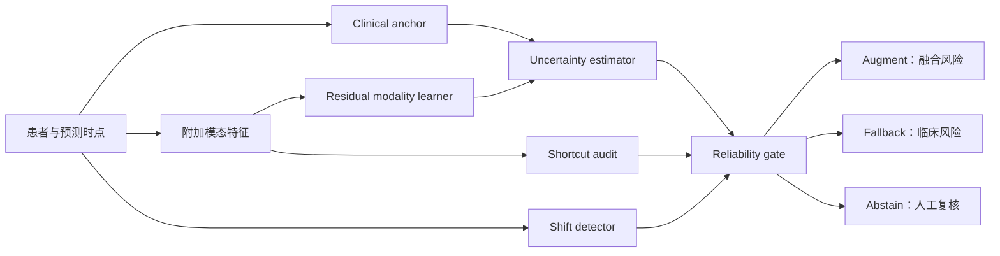

# TRUST-HN 项目总实施文档

> 项目名称：TRUST-HN  
> 目标：使用完全公开、低存储和低算力数据，开发并验证一个面向 HNSCC 预后的临床锚定、捷径感知、分布偏移检测和不确定性门控框架  
> 首选目标期刊：*npj Digital Medicine*  
> 文档版本：1.0  
> 日期：2026-08-07  
> 用途：本文件是数据获取、代码实现、统计分析、结果生成和论文写作的统一执行规范，可直接交给 Codex 分阶段实施  
> 约束：无本地或私有队列；只用公开数据；总数据量控制在几十 GB 内；不训练大型基础模型

---

## 0. 执行摘要

### 0.1 最终研究 idea

开发 **TRUST-HN**：一个资源友好的 HNSCC 预后 AI 可靠性框架。它不假设“加入更多模态一定更好”，而是先建立常规临床风险锚点，再判断 CT、病理/血液或转录组是否对当前患者提供可靠的增量信息，同时检测捷径学习、模态缺失和分布偏移，并输出三种状态：

1. **Augment**：附加模态可靠，输出临床锚点 + 附加模态的融合风险；
2. **Fallback**：附加模态不可靠，安全回退到临床锚点风险；
3. **Abstain**：连临床输入或总体预测也不可靠，提示需要人工复核。

主论文不是比较哪个网络 AUC 最高，而是检验：

> **可靠性门控能否在捷径学习、模态缺失和分布偏移下，比强制多模态融合获得更好的绝对风险校准、固定覆盖率预测误差、最差亚组表现和临床净获益。**

### 0.2 三个研究场景

| Study | 数据生态 | 临床场景 | 主要终点 | 主要失效模式 | 在论文中的作用 |
|---|---|---|---|---|---|
| Study 1 | RADCURE + ORCESTRA处理后特征 | 根治性RT/CRT前 | 24个月OS；完整OS为次要 | 肿瘤体积、形状及负对照捷径 | 主要开发和锁定测试 |
| Study 2 | HANCOCK预提取多模态特征 | 手术相关真实世界队列 | OS、复发；以可用时间戳为准 | 模态缺失、分布外、口咽癌留出 | 跨模态可靠性验证 |
| Study 3 | TCGA-HNSC→GSE65858 | 分子风险分层 | OS | RNA-seq→芯片平台偏移 | 真正独立数据平台验证 |

GSE41613仅作为 HPV 阴性 OSCC 敏感性验证；其人群和结局与全 HNSCC 不完全一致，不能冒充通用外部验证。

### 0.3 最终题目

推荐：

**Trustworthy prognostic artificial intelligence for head and neck squamous cell carcinoma under shortcut learning, missing modalities and distribution shift**

中文：

**面向捷径学习、模态缺失与分布偏移的头颈鳞癌可信预后人工智能**

备选：

- **Knowing when not to predict: uncertainty-gated prognostic AI in head and neck squamous cell carcinoma**
- **A resource-efficient reliability framework for multimodal prognosis in head and neck cancer**
- **Beyond discrimination: shortcut-aware and selectively calibrated survival prediction in head and neck cancer**

### 0.4 一句话贡献

> TRUST-HN 将“临床基线、附加模态增量、捷径敏感度、分布外程度和预测不确定性”整合为一个轻量可靠性层，使 HNSCC 预后模型能够判断何时增强预测、何时回退以及何时拒绝自动预测。

### 0.5 必须保持的诚实边界

- 本项目验证的是**共同可靠性原则在不同模态和场景中的可迁移性**，不是一个参数完全共享的万能 HNSCC 模型。
- RADCURE、HANCOCK 和 TCGA/GEO 的治疗路径、变量和起始时间不同，不允许直接合并为一个患者训练表。
- 全部数据为回顾性公开数据，不能声称已经证明前瞻性临床效益或可直接部署。
- “Fallback/Abstain”是模型风险沟通机制，不是治疗建议。
- 如无法从 RADCURE 可靠筛选鳞癌，相关 study 必须称 HNC，而不能错误标为 HNSCC。

---

## 1. 项目决策记录：从 v1 到最终方案

### 1.1 v1 的原始构想

v1提出一个能够接收任意可用模态、识别域外患者并提供校准不确定性的多队列 HNSCC 模型，计划使用原始 CT、WSI、临床和组学进行留一队列验证。

价值：问题重要、故事大、贴近真实模态缺失。  
不足：需要数百 GB 影像、不同队列变量和终点难以统一、模型复杂度高，而且难以真正实现同一模型的跨治疗场景留一队列验证。

### 1.2 v2 的可行性收缩

v2将主任务收缩到 RADCURE 处理后特征，使用真实影像组学、肿瘤体积和负对照特征研究捷径依赖。

价值：数据大、算力低、实验严谨、可执行。  
不足：若仅做单队列负对照审计，容易被视为影像组学复核，故事不足以稳定匹配 *npj Digital Medicine*。

### 1.3 v3 与本实施版的最终折中

保留 v2 的低资源、强负对照设计，同时恢复 v1 中最重要的跨模态和 OOD 问题，但不再训练一个强行共享输入的“大一统模型”。

最终策略是：

- RADCURE：影像捷径；
- HANCOCK：模态缺失与显式OOD；
- TCGA→GEO：真实平台偏移；
- 三个场景使用同一个可靠性框架和评价协议；
- 所有模型使用处理后特征或表达矩阵。

### 1.4 不纳入主项目的方向

- Multi-OSCC原始病理图像：压缩数据34.6 GB，原数据论文已进行了大量骨干、融合和多任务基准；保留为未来扩展，不作为本项目依赖。
- HN-PET-CT原始影像：约70 GB级且需受限协议；资源允许时可作为RADCURE影像模型升级验证。
- TCGA/CPTAC原始WSI：存储和计算代价高，不纳入第一版。
- 个体治疗获益、因果推断：公开治疗数据不足，且适应证混杂严重。
- 放疗后颈动脉损伤：缺少公开长期血管结局。

---

## 2. 论文的临床与科学背景

### 2.1 临床问题

HNSCC具有显著异质性。原发部位、HPV/p16状态、吸烟、ECOG、T/N分期及治疗方式均与结局相关。相同分期患者仍可能具有不同的复发和生存风险。经过验证的治疗前/治疗相关风险分层可以支持：

- 临床试验分层和入组；
- 随访和支持治疗资源配置；
- 多学科讨论中识别需要进一步检查的患者；
- 向临床人员显示风险估计及其可靠程度。

本项目不把风险预测直接等同于治疗获益，不建议根据模型单独改变放疗或手术方案。

### 2.2 当前预后AI的三个缺口

#### 缺口一：更多模态不等于更多有效信息

CT、病理、临床和组学可以包含互补信息，但高维附加模态也可能只是重复临床分期、肿瘤体积或数据采集流程。已有公开肿瘤多模态工作提示临床特征经常是最强单模态，多模态融合并不总能超过临床基线。

#### 缺口二：内部判别力掩盖部署失败

随机划分的数据通常与训练数据高度相似。面对新时间段、新肿瘤部位、新中心或不同检测平台时，绝对风险校准可能在AUC仍看似可接受时已经明显失效。

#### 缺口三：模型不会说“不知道”

大多数模型被迫对每名患者给出风险。临床系统更需要：识别不熟悉的患者、表达预测区间、在附加模态不可靠时回退，并在整体不可靠时请求人工复核。

### 2.3 Motivation

本研究从“模型中心”转向“临床决策中心”：

- 不是问哪个模型平均C-index最高；
- 而是问附加模态是否有可靠增量价值；
- 不是强制融合所有数据；
- 而是允许模型安全降级；
- 不是把不确定性作为补充图；
- 而是把不确定性转化为Augment/Fallback/Abstain动作。

### 2.4 与目标期刊的关系

*npj Digital Medicine*关注临床应用和经过验证的AI/ML模型，并说明通常不考虑直接套用现成工具、纯观察性或小规模初步研究：[Aims and scope](https://www.nature.com/npjdigitalmed/aims)。

该刊已将捷径学习、泛化估计、模型校准和不确定性沟通作为重要主题：

- [Shortcut learning in medical AI hinders generalization](https://www.nature.com/articles/s41746-024-01118-4)
- [Second opinion needed: communicating uncertainty in medical machine learning](https://www.nature.com/articles/s41746-020-00367-3)
- [Stress testing reveals gaps in clinic readiness of image-based diagnostic AI models](https://www.nature.com/articles/s41746-020-00380-6)

TRUST-HN的期刊级贡献不在于发明每个单独组件，而在于将临床锚定、增量学习、捷径审计、OOD检测、校准和安全降级整合为一个可复现框架，并在三种HNSCC公开数据生态中验证。

---

## 3. 研究问题、PICOTS与假设

### 3.1 Primary research question

在公开HNSCC预后数据中，与强制使用所有附加模态相比，TRUST-HN可靠性门控能否在分布偏移或模态失效时改善绝对风险误差、校准、最差亚组表现及临床净获益？

### 3.2 PICOTS

| 项目 | 定义 |
|---|---|
| Population | 成人、初诊或进入相应根治性治疗场景、病理证实HNSCC；每个study另行定义 |
| Index model | TRUST-HN：clinical anchor + residual modality learner + shortcut/shift/uncertainty gate |
| Comparator | 临床基线、附加模态单独模型、强制融合模型、始终回退模型、简单不确定性拒判 |
| Outcome | 主要为24个月OS；完整OS及复发为次要且按数据集定义 |
| Timing | 所有预测变量必须在各study的index date时已经可获得 |
| Setting | 根治性RT/CRT、手术真实世界队列、分子研究队列分别验证，不直接混合 |
| Intended use | 风险分层和人工复核提示；不直接推荐治疗 |

### 3.3 研究目标

#### Primary objective

开发和验证TRUST-HN，使其在附加模态不完整、存在捷径或发生分布偏移时，能够在Augment、Fallback和Abstain之间选择。

#### Secondary objectives

1. 量化影像、病理/血液和转录组相对临床锚点的增量价值；
2. 比较真实模态和结构匹配负对照的预测能力；
3. 检验不确定性和OOD分数能否识别高错误病例；
4. 评价不同HPV、部位、年龄、性别和治疗亚组中的校准与自动覆盖率；
5. 验证同一可靠性原则在三种数据生态中的方向一致性。

### 3.4 预设假设

- H1：强制融合在分布内数据上具有合理判别力，但在负对照、缺失模态和OOD环境下校准恶化。
- H2：clinical anchor + residual modality learning比直接拼接更少依赖体积、缺失模式或平台信息。
- H3：综合OOD、区间宽度、shortcut sensitivity和缺失标志的门控，在固定80%和90%覆盖率下降低Brier score。
- H4：当附加模态不可靠时，Fallback优于强制融合；当临床输入也不可靠时，Abstain优于继续输出高置信风险。

### 3.5 不把结果预设成成功

允许出现以下结果：

- 附加模态没有临床有意义的增量价值；
- 负对照可复制真实特征性能；
- OOD检测不能可靠预测误差；
- 门控减少覆盖率但没有改善净获益。

若出现这些结果，应如实报告。项目是否适合继续投稿npj DM由预设go/no-go标准决定，而不能通过事后更换终点或挑选模型制造阳性结果。

---

## 4. 系统概念与模型架构



### 4.1 Clinical anchor

使用各临床场景在预测时点常规可获得的低维变量。候选变量包括：

- 年龄、性别；
- ECOG或其他体能状态；
- 原发部位；
- T、N、M、总体分期；
- HPV/p16；
- 吸烟；
- 在index date已确定的治疗计划变量。

主模型：elastic-net Cox。  
备选：XGBoost-Cox/AFT、小型离散时间MLP。  
原则：只纳入实际数据字典确认存在且预测时点可用的变量。

### 4.2 Residual modality learner

附加模态不重新学习全部风险，而是学习临床锚点未解释的部分。

优先实现两种方式并比较：

1. **Offset survival model**：将clinical anchor的线性预测值作为offset；
2. **Stacked residual model**：使用训练集out-of-fold clinical risk作为一个固定输入，附加模态模型学习剩余风险。

直接把临床和高维模态拼接的模型作为强制融合对照，而不是主模型。

### 4.3 Shortcut audit

#### RADCURE

- 真实PyRadiomics；
- log(GTVp体积)；
- 随机体素负对照特征；
- 打乱体素负对照特征；
- 对真实特征进行体积残差化；
- 比较风险分数与log(GTVp)相关性。

#### HANCOCK

- 患者间随机置换某一模态；
- 仅使用模态缺失指示器；
- 随机modality dropout；
- 结构性移除病理、血液、文本编码或TMA特征；
- 检查模型是否利用“某模态是否存在”而不是模态内容。

#### TCGA/GEO

- 在训练折内置换基因或通路分数；
- 保留批次/平台结构的分层置换；
- 比较gene-level与rank/pathway-level迁移；
- 训练平台分类器，检验风险embedding是否主要编码平台来源。

### 4.4 Shift detector

第一版实现：

- shrinkage Mahalanobis distance；
- kNN distance；
- Isolation Forest。

输入应为预处理后的clinical和modality embedding，但预处理器只能在训练集拟合。OOD检测不得使用测试结局。

主OOD分数可取三种方法在验证集标准化后的平均rank；单方法结果作为消融。

### 4.5 Uncertainty estimator

主方法：

- 对每类模型进行200次以上bootstrap重拟合或使用20–50个轻量bootstrap ensemble；
- 输出24个月风险分布、中位数、标准差和95%区间；
- 评价区间宽度与患者级预测误差的关系。

升级方法：

- 交叉拟合的conformal survival interval；
- 只有在正确处理删失且经验覆盖率验证通过后，才作为主文结果；
- 若实现不稳定，保留为补充实验，不影响主项目完成。

### 4.6 Reliability score与门控

候选输入：

- modality OOD rank；
- clinical OOD rank；
- bootstrap风险区间宽度；
- shortcut sensitivity；
- 模态缺失数量和模式；
- 不同基模型预测分歧。

建议主门控使用可解释的规则：

1. 在训练集交叉验证产生完整OOF预测；
2. 在独立校准集上将各可靠性指标转为0–1 rank；
3. 预设等权可靠性分数作为主分析；
4. 以非负逻辑回归学习权重作为敏感性分析；
5. 阈值只在校准集选择，以达到90%和80%自动覆盖率；
6. 测试集不得重新选择阈值。

决策规则：

```text
if clinical_input_is_OOD or clinical_uncertainty > tau_clinical:
    action = ABSTAIN
elif modality_missing or modality_unreliable:
    action = FALLBACK
else:
    action = AUGMENT
```

输出必须同时保留：最终风险、临床锚点风险、附加模态增量、可靠性分数、动作和动作原因。

---

## 5. 数据集实施规范

### 5.1 总体原则

- 原始下载文件只读保存；
- 每个数据集建立来源、版本、下载日期、哈希和许可证manifest；
- 不把受限数据、原始患者数据或大文件提交Git；
- 患者ID在本地映射为项目ID，但保留可追溯映射表于git忽略目录；
- 所有拆分按患者进行；
- 数据处理产生可重复的parquet/CSV和schema文件；
- 每个数据适配器输出统一接口，但不强制共享变量。

统一接口：

```text
patient_id
cohort_id
split_id
index_date_definition
time
event
endpoint_name
X_clinical
X_modalities: {radiomics | pathology_blood_text_tma | transcriptomics}
modality_mask
subgroups
provenance
```

### 5.2 Study 1：RADCURE

#### 已确认事实

- TCIA原始集合3,346名患者；
- 2005–2017年接受根治性RT；
- CT来自三家设备制造商；
- 约50%为口咽癌；
- 中位随访约5年；
- 原始影像约333 GB且为受限许可；
- 临床CSV约452 kB、CC BY 4.0；
- ORCESTRA `RADCURE_Features` DOI为`10.5281/zenodo.14226536`，版本和大小下载前再次核验；
- 公开处理报告包含约2,949名患者、2,988个GTVp和1,317个PyRadiomics特征，并提供两类负对照。

入口：

- [TCIA RADCURE](https://wiki.cancerimagingarchive.net/pages/viewpage.action?pageId=70226325)
- [ORCESTRA RADCURE_Features](https://www.orcestra.ca/radiomicset/6746454c0c5b69993c6cbe21)
- [RADCURE challenge](https://pmc.ncbi.nlm.nih.gov/articles/PMC10309070/)
- [Open-source radiomics processing and negative controls](https://www.sciencedirect.com/science/article/pii/S0167814024004377)

#### 下载后必须核验

- 组织学字段能否筛选鳞癌；
- M0/根治性意图字段；
- index date和OS起算点；
- challenge train/test标签；
- 24个月前删失情况；
- HPV/p16、ECOG、吸烟及治疗变量缺失率；
- GTVp体积字段和多GTV患者；
- 两类负对照与真实特征能否患者级匹配；
- 扫描制造商/年份等shift字段是否进入处理后对象；
- FMCIB或其他深度特征的训练来源，是否接触锁定测试病例。

#### 纳入标准

- 成人；
- 病理证实HNSCC，若字段可用；
- 非转移；
- 根治性RT/CRT；
- 有GTVp和可匹配处理后特征；
- 生存时间和死亡状态可确定。

#### 排除标准

- 非鳞癌或无法确定病理；
- 姑息性治疗或基线远处转移；
- 只有淋巴结、无可用GTVp；
- 生存时间/状态逻辑矛盾；
- 关键ID无法匹配。

#### 终点

- 主要：从治疗前index date起24个月OS；
- 次要：完整OS；
- 24个月前失访且未死亡者保持删失，不能作为二分类阴性。

#### 拆分

- 优先使用challenge预定义train/test；
- 训练部分再固定development/calibration，或内部嵌套交叉验证；
- 测试集在预处理、特征选择、阈值和超参数冻结前不得使用；
- 如果challenge标签无法复现，使用年份定义的时间拆分；
- 随机拆分只作为展示乐观偏差的压力测试，不作为主结果。

### 5.3 Study 2：HANCOCK

#### 已确认事实

- 763名患者；
- 包含人口学、临床病理、血液、手术文本、WSI和TMA；
- 官方代码提供预提取患者向量；
- 官方提供分布内、算法定义分布外及全部口咽癌留出划分；
- 原论文进行复发和生存状态分类，最高平均AUC约0.79；
- 不下载原始WSI即可复现多数特征级实验。

入口：

- [Nature Communications数据论文](https://www.nature.com/articles/s41467-025-62386-6)
- [HANCOCK官方代码](https://github.com/ankilab/HANCOCK_MultimodalDataset)

#### 下载后必须核验

- 鳞癌筛选；
- 手术/治疗路径及index date；
- OS和复发是否都有时间与事件；
- 原论文的`survival_status`是否只是截面状态；
- 预提取特征的104维定义和各模态列映射；
- ID/OOD/口咽癌拆分是否患者级互斥；
- 模态缺失是自然缺失还是编码后的填充值；
- 预提取特征是否使用全队列拟合编码器或标准化器。

#### 任务优先级

1. 若有完整时间到事件：OS生存；
2. 若复发时间完整：复发生存；
3. 若只有状态：作为二分类压力测试，不能与RADCURE生存结果直接合并；
4. 口咽癌留出用于部位OOD；
5. 自然缺失与人工modality dropout分别评价。

### 5.4 Study 3：TCGA-HNSC→GSE65858

#### 已确认事实

- TCGA-HNSC约528个表征病例，含临床和RNA-seq等多组学；
- GSE65858有270个质控后HNSCC芯片样本，含HPV/TP53、淋巴结和生存信息；
- GSE41613含97名HPV阴性OSCC及OSCC特异生存。

入口：

- [NCI TCGA studied cancers](https://www.cancer.gov/ccg/research/genome-sequencing/tcga/studied-cancers)
- [GEO GSE65858](https://www.ncbi.nlm.nih.gov/geo/query/acc.cgi?acc=GSE65858)
- [GEO GSE41613](https://www.ncbi.nlm.nih.gov/geo/query/acc.cgi?acc=GSE41613)

#### 数据处理

- TCGA使用公开、已标准化的RNA-seq表达和临床信息；
- GSE65858使用官方processed matrix，保留其原始归一化说明；
- 探针映射至gene symbol，多个探针的聚合规则固定并记录；
- 不直接对两个平台拼接后做全数据ComBat；
- 主表示使用样本内rank或ssGSEA/GSVA类通路分数；
- 候选通路使用Hallmark，必要时补充Reactome；
- 通路选择只在TCGA训练折进行；
- GSE65858在模型和通路集冻结后一次性外部测试。

#### 临床变量

- 先建立TCGA与GSE65858共同字段表；
- 若共同临床变量足够，建立clinical anchor + pathway residual模型；
- 若不足，Study 3降级为pathway模型的shift detection和calibration研究，不声称clinical fallback；
- GSE41613只在部位、HPV和终点定义可比时验证方向。

#### 终点协调

- 明确每个队列OS或癌症特异生存的定义和起点；
- 不把OS与OSCC特异生存直接合并；
- 不将GSE41613结果与全HNSCC外部性能做数值合并。

---

## 6. 数据审计与go/no-go

### 6.1 Phase 1必须输出的审计文件

每个数据集生成：

- `data_manifest.yaml`：来源、版本、许可、文件哈希；
- `data_dictionary.csv`：原始字段、含义、单位、类型、时间点；
- `cohort_flow.csv`：每步纳排人数；
- `missingness.csv`：总体和按split缺失率；
- `endpoint_audit.md`：起点、终点、删失和异常值；
- `split_audit.md`：患者重叠、事件率和分布差异；
- `leakage_audit.md`：可能的结局后变量、全队列预处理和embedding来源；
- `license_notes.md`：是否允许代码、派生表和模型权重公开。

### 6.2 Go条件

- RADCURE可形成足量的HNSCC或清楚定义的HNC主队列；
- RADCURE有可复现的锁定或时间测试；
- 24个月OS和删失可正确构建；
- 真实与负对照特征可患者级匹配；
- HANCOCK至少能复现一种ID/OOD任务；
- TCGA→GSE65858的OS和表达平台可完成冻结模型迁移；
- 所有数据许可允许本项目分析和公开代码。

### 6.3 条件通过

- RADCURE不能确认鳞癌：继续做HNC study，但主标题是否保留HNSCC需由HANCOCK/TCGA结果决定；
- HANCOCK无时间到事件：将其限定为二分类可靠性压力测试；
- GSE65858临床字段不足：做pathway-only外部shift study；
- FMCIB特征存在潜在测试泄漏：完全移出主分析，仅保留有清楚来源的PyRadiomics。

### 6.4 No-go条件

- RADCURE结局或challenge拆分无法复现；
- 负对照与真实特征不能可靠匹配；
- HANCOCK和TCGA/GEO均无法完成独立于随机拆分的压力验证；
- 最终项目只能退化为普通随机拆分AUC比较；
- 数据许可不允许关键分析或复现。

---

## 7. 预处理与防泄漏规范

### 7.1 数据拆分顺序

1. 先建立patient-level manifest；
2. 再应用官方或时间拆分；
3. 测试ID单独保存为sealed manifest；
4. 训练集内生成CV folds；
5. 所有预处理在训练fold拟合；
6. 校准集只用于风险校准和门控阈值；
7. 测试集只在方案冻结后运行。

### 7.2 缺失值

- 连续变量：训练折中位数或迭代插补；
- 分类变量：显式`Unknown`；
- 所有变量增加必要的missing indicator；
- 比较“内容模型”和“只有missingness pattern模型”；
- 多重插补作为统计敏感性分析，不要求每个机器学习模型都运行多重插补；
- 插补器不得看测试分布。

### 7.3 标准化与特征选择

- 标准化、相关过滤、残差化、通路选择和稳定性选择全部在训练fold拟合；
- 禁止使用全数据方差、相关性或结局做预筛选；
- 高维模型优先使用正则化，不根据测试结果手选特征；
- 记录每折入选特征和选择稳定性。

### 7.4 多样本患者

- 同一患者多个GTV、切片或样本不得跨split；
- RADCURE多GTV患者优先患者级聚合：最大体积或预设pooling；
- 所有bootstrap按患者抽样；
- 不能把2,988个GTV错误报告成2,988名独立患者。

### 7.5 禁止使用的变量

- 复发后治疗；
- 随访过程中测量的变量；
- 未来才知道的复发时间或状态；
- 治疗后影像；
- 以全生存结局反推的高低风险组标签；
- 任何由测试结局生成的特征或阈值。

### 7.6 深度特征provenance

对所有预提取embedding记录：

- 基础模型名称和权重来源；
- 是否在目标数据集微调；
- 微调时是否包含测试患者；
- patch/ROI和患者聚合方法；
- 特征维度；
- 许可证。

来源不清的深度特征不能进入主结果。

---

## 8. 模型矩阵

### 8.1 所有study共有基线

| ID | 模型 | 目的 |
|---|---|---|
| B0 | Kaplan-Meier/事件率基线 | 检查模型是否优于无个体信息预测 |
| B1 | Clinical Cox | 临床锚点 |
| B2 | Clinical elastic-net Cox | 正则化临床基线 |
| B3 | Clinical RSF或XGBoost | 非线性临床基线 |
| B4 | Modality-only | 附加模态单独能力 |
| B5 | Direct concatenation | 强制融合对照 |
| B6 | Residual/offset fusion | TRUST-HN增量学习核心 |
| B7 | Reliability-gated fusion | 完整TRUST-HN |

### 8.2 RADCURE专用模型

| ID | 输入 |
|---|---|
| R0 | clinical only |
| R1 | log(GTVp) only |
| R2 | clinical + log(GTVp) |
| R3 | real PyRadiomics only |
| R4 | clinical + volume + real PyRadiomics，直接融合 |
| R5 | clinical + volume + random-voxel features |
| R6 | clinical + volume + shuffled-voxel features |
| R7 | clinical + volume + volume-residualized PyRadiomics |
| R8 | clinical anchor + residualized modality + gate |
| R9 | 深度特征探索模型，仅通过provenance审计后启用 |

### 8.3 HANCOCK专用实验

- clinical/pathology only；
- clinical + blood；
- clinical + ICD/text encoding；
- clinical + TMA；
- all available features；
- missingness indicators only；
- modality permutation；
- random modality dropout；
- natural missingness；
- ID、algorithmic OOD和oropharynx OOD分别测试；
- TRUST-HN gate与强制融合比较。

### 8.4 TCGA/GEO专用实验

- clinical only（字段足够时）；
- gene-level elastic-net Cox；
- Hallmark pathway-level Cox；
- pathway-level RSF/XGBoost；
- clinical + pathway direct fusion；
- clinical anchor + pathway residual；
- platform classifier和OOD score；
- 不校准外部预测 vs 仅使用训练/校准信息的预设校准；
- gate/abstention在GSE65858上的risk–coverage。

### 8.5 小型神经网络

仅作为敏感性分析：

- 2–3隐藏层；
- 参数量<100万；
- early stopping；
- 固定随机种子集合；
- 不因性能略高而删除透明统计模型；
- 最终模型选择综合校准、稳定性和复杂度，而不是只按C-index。

---

## 9. 主要终点与统计分析计划

### 9.1 Primary demonstration

RADCURE锁定测试集上的24个月OS。

主要性能指标：

1. 24个月IPCW Brier score；
2. calibration-in-the-large；
3. calibration slope；
4. 24个月time-dependent AUC；
5. Uno C-index；
6. decision-curve net benefit。

### 9.2 Primary method comparison

在RADCURE锁定测试中比较：

- 强制融合B5/R4；
- 完整TRUST-HN B7/R8。

首要比较是24个月IPCW Brier score的患者级配对差值。判别力是次要，不把AUC作为唯一成功标准。

### 9.3 Trustworthiness endpoints

- 固定90%覆盖率下的Brier score；
- 固定80%覆盖率下的Brier score；
- risk–coverage curve及面积；
- OOD分数与患者级误差关系；
- bootstrap区间宽度与误差关系；
- 最差亚组Brier和校准；
- Fallback相对强制融合的性能；
- shortcut performance retention：负对照性能/真实特征性能；
- 风险分数与log(GTVp)相关性。

### 9.4 删失处理

- 主分析使用时间到事件模型；
- 24个月前未死亡但失访者保持右删失；
- 时间依赖AUC和Brier使用IPCW；
- IPCW删失模型只在相应训练/评价样本中估计；
- 检查极端权重并进行截断敏感性分析；
- 不把早期删失者直接作为24个月存活。

### 9.5 置信区间和检验

- 最终测试结果使用患者级配对bootstrap，建议2,000次；
- 报告点估计、95%CI和配对差值；
- 训练阶段可使用较少bootstrap加速，最终结果再升至2,000；
- 不对所有模型进行无穷两两检验；
- 预设主比较后，其余标为secondary/exploratory；
- 多亚组结果以效应和区间为主，必要时控制FDR。

### 9.6 亚组

优先：

- HPV/p16阳性与阴性；
- 口咽与非口咽；
- 性别；
- 年龄组；
- T/N分期；
- RT与CRT；
- 数据获取时期或设备厂商（字段可用时）。

只有样本量和事件数足够的亚组才报告稳定估计。建议每亚组至少20个事件；不足时只描述并明确不确定性。亚组差异不能自动解释为算法歧视，需要结合基线风险和病例组合讨论。

### 9.7 临床净获益

- 使用24个月死亡风险的decision curve；
- 绘制一段合理阈值范围，而不是事后挑选单一最佳阈值；
- 与treat-all、treat-none、临床锚点比较；
- 因本项目不直接对应某项治疗，DCA应解释为“触发强化复核/支持管理”的研究性情境；
- 未经临床专家确认前，不把某个阈值描述为临床推荐。

### 9.8 跨study综合

- 三个study终点和场景不同，不进行简单患者合并；
- 不对不同定义的AUC/C-index进行虚假meta-analysis；
- 以标准化方向、risk–coverage、校准改善和森林图展示方法一致性；
- 如指标定义完全一致，可报告dataset-level paired difference，但保持每个study独立。

### 9.9 模型选择规则

最终模型不得只依据测试C-index选择。优先级：

1. 通过泄漏和provenance审计；
2. 校准可靠；
3. 锁定/OOD/外部测试稳定；
4. risk–coverage优；
5. DCA不劣；
6. 复杂度低；
7. 判别力作为综合指标之一。

---

## 10. 必做消融与压力测试

### 10.1 通用

- clinical anchor vs modality-only vs direct fusion vs residual fusion；
- 无gate vs OOD-only gate vs uncertainty-only gate vs完整gate；
- 等权gate vs学习权重gate；
- 100%、90%、80%覆盖率；
- 随机拆分 vs锁定/OOD/外部测试；
- 不同随机种子和不同模型家族；
- 缺失指示器模型；
- 不同插补方法。

### 10.2 RADCURE

- 不含体积 vs含体积；
- 真实特征 vs两类负对照；
- 原始特征 vs体积残差化；
- 全特征 vs稳定性选择；
- 全HNSCC/HNC vs口咽亚组；
- HPV纳入与不纳入；
- 患者多GTV不同聚合策略；
- 深度特征是否加入。

### 10.3 HANCOCK

- 自然缺失 vs随机缺失；
- 缺1个、2个及多个模态；
- ID vsalgorithmic OOD vs口咽留出；
- 模态内容 vs仅缺失模式；
- 复发状态分类 vs时间到事件（如果两者均可）。

### 10.4 TCGA/GEO

- gene-level vsrank/pathway-level；
- Hallmark vsReactome；
- 全数据ComBat禁止作为主方法，可作为显示泄漏风险的对照；
- platform classifier；
- TCGA内部CV vsGSE65858外部；
- GSE41613匹配亚组敏感性。

---

## 11. 软件仓库设计

建议在当前项目下建立独立目录`trust-hn/`：

```text
trust-hn/
├── README.md
├── PROJECT_STATUS.md
├── pyproject.toml
├── environment.yml
├── .gitignore
├── configs/
│   ├── base.yaml
│   ├── radcure.yaml
│   ├── hancock.yaml
│   ├── tcga_geo.yaml
│   └── experiments/
├── data/
│   ├── README.md
│   ├── raw/                 # gitignored, immutable
│   ├── interim/             # gitignored
│   ├── processed/           # gitignored
│   ├── manifests/
│   └── schemas/
├── src/trust_hn/
│   ├── data/
│   │   ├── base.py
│   │   ├── radcure.py
│   │   ├── hancock.py
│   │   └── tcga_geo.py
│   ├── preprocessing/
│   ├── models/
│   │   ├── clinical_anchor.py
│   │   ├── residual.py
│   │   ├── survival_baselines.py
│   │   └── small_mlp.py
│   ├── reliability/
│   │   ├── shortcut.py
│   │   ├── ood.py
│   │   ├── uncertainty.py
│   │   └── gate.py
│   ├── evaluation/
│   │   ├── survival_metrics.py
│   │   ├── calibration.py
│   │   ├── selective_prediction.py
│   │   ├── decision_curve.py
│   │   └── bootstrap.py
│   ├── reporting/
│   └── utils/
├── scripts/
│   ├── download_or_register_data.py
│   ├── audit_data.py
│   ├── build_dataset.py
│   ├── train_baselines.py
│   ├── train_trust_hn.py
│   ├── evaluate_locked_test.py
│   └── make_paper_figures.py
├── tests/
├── notebooks/               # exploration only, not authoritative pipeline
├── results/
│   ├── manifests/
│   ├── metrics/
│   ├── predictions/
│   ├── figures/
│   └── tables/
├── paper/
│   ├── manuscript.md
│   ├── supplement.md
│   ├── references.bib
│   └── figure_legends.md
└── docs/
    ├── data_dictionary/
    ├── sap.md
    ├── model_card.md
    └── reproducibility.md
```

### 11.1 配置驱动

所有运行应由YAML控制：

- 数据版本和路径；
- endpoint；
- split；
- predictors；
- preprocessing；
- model；
- random seed；
- coverage levels；
- bootstrap次数；
- 输出目录。

禁止把测试路径、阈值和特征列表散落在notebook中。

### 11.2 推荐技术栈

- Python 3.11；
- pandas或polars、pyarrow；
- scikit-learn；
- scikit-survival；
- lifelines用于检查和可视化；
- xgboost；
- PyTorch/pycox仅用于小MLP；
- matplotlib、seaborn；
- shap仅用于有限解释实验；
- R/Bioconductor只用于读取ORCESTRA对象或GSVA等必要步骤，随后导出parquet。

依赖版本必须固定。若某包许可证或安装困难，优先保证Cox/RSF/评估管线完整，不因非核心深度模型阻塞项目。

### 11.3 随机性和复现

- 全局seed列表预先固定，例如`[17, 29, 43, 71, 101]`；
- 保存git commit、环境锁、配置哈希和数据manifest哈希；
- 每次run生成唯一ID；
- 所有表格由代码生成，禁止手工抄录数值；
- 论文中的每个数值可追踪到预测文件和配置。

### 11.4 自动测试

至少包括：

- patient split无重叠；
- 同一患者多样本不跨split；
- 预处理器未在测试集fit；
- 生存时间非负、事件为0/1；
- 24个月标签与删失逻辑正确；
- 预测生存曲线单调；
- 指标在小型合成数据上与参考实现一致；
- 随机种子可复现；
- sealed test评估脚本拒绝在配置未冻结时运行；
- 结果表中样本量与预测行数一致。

---

## 12. 分阶段执行计划

### Phase 0：仓库和治理

任务：

- 建立上述目录；
- 创建README、环境和配置；
- 建立数据许可/manifest模板；
- 建立`PROJECT_STATUS.md`；
- 添加基础CI或本地测试命令；
- 将测试集封存机制写入代码。

完成标准：

- 空数据情况下单元测试通过；
- `make test`或等效命令可运行；
- README说明数据不会进入Git。

### Phase 1：数据获取与可行性审计

任务：

- 只下载临床表、处理后特征、表达矩阵和官方split；
- 不下载333 GB RADCURE CT或HANCOCK WSI；
- 生成第6节全部审计文件；
- 核验HNSCC、index date、结局、删失和许可；
- 写go/no-go报告。

完成标准：

- 每个study有patient-level cohort flow；
- 终点和split可复现；
- 无患者重叠；
- 已决定每个study的正式任务或降级任务。

### Phase 2：统一接口和描述性分析

任务：

- 编写三个dataset adapter；
- 输出统一数据合同；
- 生成Table 1候选内容；
- 生成缺失热图、事件分布和Kaplan-Meier；
- 比较train/calibration/test病例组合。

完成标准：

- 任何模型都通过同一接口读取数据；
- 描述性结果与官方论文规模基本一致，差异有解释；
- endpoint audit无未解决严重错误。

### Phase 3：基线模型

任务：

- 完成B0–B5；
- 生成OOF预测；
- 完成IPCW、C-index、校准和DCA实现；
- 复现RADCURE/HANCOCK官方方向性结果；
- 不运行sealed test，或只按预定义允许一次基线复现。

完成标准：

- 临床基线合理；
- 负对照和缺失模式模型可运行；
- 训练/验证结果稳定；
- 无泄漏迹象。

### Phase 4：TRUST-HN核心

任务：

- residual/offset learner；
- shortcut sensitivity；
- 三种OOD检测；
- bootstrap uncertainty；
- reliability score；
- Augment/Fallback/Abstain门控；
- 80%和90%覆盖率阈值。

完成标准：

- 每名患者输出完整决策轨迹；
- gate阈值只来自校准集；
- risk–coverage曲线可生成；
- 至少一个合成shift测试证明代码逻辑正确。

### Phase 5：压力测试和消融

任务：

- 完成第10节实验；
- 比较不同失败模式；
- 亚组和最差组分析；
- 选择最终冻结配置；
- 写`analysis_freeze.yaml`和时间戳。

完成标准：

- 主模型、阈值、指标、亚组和图表计划冻结；
- 生成明确的测试解封批准记录；
- 不再根据测试结果改变主要假设。

### Phase 6：锁定测试和最终统计

任务：

- 一次性运行RADCURE locked test、HANCOCK OOD和GSE65858 external test；
- 2,000次患者级配对bootstrap；
- 输出所有主表、补充表和预测文件；
- 执行TRIPOD+AI与PROBAST+AI自评。

完成标准：

- 所有主结果可从单一命令重现；
- 结果不依赖手工处理；
- 自评问题有逐项回应。

### Phase 7：论文图表与写作

任务：

- 按第15–17节写作；
- 所有结果句与表格/图对应；
- 区分预设和探索性分析；
- 完成主文、补充材料、代码说明和model card；
- 对标题和摘要避免过度声称。

### Phase 8：复现与投稿准备

任务：

- 在干净环境从manifest重跑；
- 创建最小示例或合成数据demo；
- 公开代码、冻结release和DOI；
- 完成数据与代码可用性声明；
- 核对期刊格式和补充清单。

---

## 13. 里程碑与决策门槛

| 里程碑 | 关键产物 | 决策 |
|---|---|---|
| M1 数据可用 | audit、字典、纳排流程、许可 | 是否继续三study |
| M2 基线可信 | 临床、模态、强制融合、负对照 | 是否存在值得研究的失效模式 |
| M3 Gate有效 | validation risk–coverage和fallback | 是否冻结TRUST-HN |
| M4 外部/OOD验证 | RADCURE test、HANCOCK OOD、GSE65858 | 是否保留npj DM目标 |
| M5 论文完整 | 主文、补充、代码、清单 | 投稿或调整期刊 |

建议保持*npj Digital Medicine*目标的最低结果条件：

- 至少两个独立数据生态显示强制融合存在可量化失效；
- reliability score与真实误差相关；
- gate在预设覆盖率下改善Brier或校准；
- fallback优于强制融合或简单拒判；
- 改善在HANCOCK OOD或GSE65858外部测试中至少一个成立；
- DCA、校准和亚组覆盖率完整；
- 代码和分析可复现。

若只有RADCURE负对照结果，转向Radiology: AI、Medical Physics、European Radiology Experimental或类似专科期刊更现实。

---

## 14. 预期结果的科学叙事

注意：以下是预期叙事，不是可以提前写成事实的结果。

### Result 1：内部性能建立合理基线

临床、附加模态和强制融合模型在ID数据上具有一定判别力。先证明任务和实现不是无效的，再进入可信度分析。

### Result 2：平均判别力掩盖隐藏失败

- RADCURE：体积或负对照重现部分影像性能；
- HANCOCK：模态缺失和口咽癌留出导致风险失校准；
- TCGA→GEO：跨平台迁移使绝对风险尺度失配；
- 某些情况下AUC变化小于校准和Brier恶化。

### Result 3：Clinical anchoring限制无效融合

残余学习要求附加模态解释临床锚点之外的信息，从而减少简单复制分期、体积或平台来源。

### Result 4：可靠性指标识别高错误患者

OOD、区间宽度、模型分歧和shortcut sensitivity与患者级误差相关；最不可靠患者具有更差校准。

### Result 5：Fallback和Abstain改善安全性

在固定覆盖率下，TRUST-HN相对强制融合降低Brier和最差组误差；附加模态不可靠时回退临床风险比强制融合更稳定。

### Result 6：可靠性原则跨模态复现

三种场景分别训练模型，但临床锚定—增量判断—可靠性门控在影像、多模态临床病理和转录组中呈现一致方法学价值。

### 阴性结果仍可回答的问题

若附加模态普遍不能超过临床锚点，论文可得出：在这些公开HNSCC数据中，复杂模态未显示足够稳定的部署增量，强制融合会制造不必要复杂度。前提是外部/OOD验证和统计精度足够。

---

## 15. 主论文写作框架

### 15.1 Abstract

#### Background

- HNSCC预后AI不断加入影像、病理和分子数据；
- 增量性能可能来自捷径，且模型通常不识别OOD或缺失模态；
- 临床系统需要风险及其可靠性。

#### Methods

- TRUST-HN六模块；
- 三个公开数据生态；
- 轻量生存模型；
- 主要终点与锁定/OOD/外部验证；
- 校准、Brier、DCA、risk–coverage。

#### Results

按最终数据填入：样本数、事件数、主要Brier差、校准、覆盖率、OOD/外部结果。禁止只写最佳AUC。

#### Conclusions

回答可靠性门控是否优于强制融合，以及仍需前瞻性验证。

### 15.2 Introduction：建议5段

1. HNSCC异质性和风险分层需求；
2. 影像/病理/组学多模态预后AI进展；
3. 当前缺陷：临床特征强、捷径、模态缺失、OOD和失校准；
4. 临床需要安全失败和资源友好方法；
5. 本研究假设、TRUST-HN和三study设计。

Introduction末段模板：

> In this study, we hypothesized that the clinical utility of prognostic artificial intelligence in HNSCC could be improved by explicitly separating baseline clinical risk from the incremental contribution of additional modalities and by withholding multimodal predictions when shortcut dependence, distribution shift or predictive uncertainty is high. We therefore developed TRUST-HN, a resource-efficient framework integrating clinical anchoring, residual modality learning, shortcut testing, shift detection, survival calibration and selective prediction. We evaluated the framework across publicly available radiomic, clinicopathological and transcriptomic HNSCC cohorts representing definitive radiotherapy, surgical and cross-platform molecular settings. Rather than seeking a universally shared predictor across heterogeneous cohorts, we tested whether a common reliability strategy could consistently identify when modality augmentation was beneficial, when fallback to clinical risk was safer and when automated prediction should be withheld.

### 15.3 Methods结构

1. Study design and reporting framework；
2. Data sources and ethics/data governance；
3. Participants and cohort-specific index dates；
4. Outcomes；
5. Predictors and modality definitions；
6. Data preprocessing and missingness；
7. Data partitions and test sealing；
8. Clinical anchor models；
9. Residual modality learning；
10. Shortcut controls；
11. Distribution-shift detection；
12. Uncertainty estimation and calibration；
13. Reliability gate and selective prediction；
14. Comparators and ablations；
15. Statistical analysis；
16. Fairness/subgroups；
17. Software and reproducibility。

### 15.4 Results结构

1. Cohort derivation and baseline characteristics；
2. Performance of clinical, modality and direct-fusion baselines；
3. Shortcut dependence in RADCURE；
4. Failure under missing modalities and OOD in HANCOCK；
5. Cross-platform shift from TCGA-HNSC to GSE65858；
6. Reliability score and error association；
7. Augment/Fallback/Abstain performance；
8. Calibration and decision-curve analysis；
9. Subgroup and sensitivity analyses；
10. Computational efficiency。

### 15.5 Discussion结构

1. 主要发现，不重复所有数值；
2. 为什么平均AUC不足以代表部署安全；
3. 临床锚点和残余模态学习的意义；
4. Fallback与Abstain如何进入真实工作流；
5. 与HNSCC多模态、shortcut learning和uncertainty文献比较；
6. 资源友好和可复现性价值；
7. 局限：回顾性、不同场景、非同一共享模型、公开特征、无前瞻性临床影响；
8. 下一步：独立医院冻结验证、静默前瞻、医生-AI研究。

### 15.6 结论应避免的表述

不要写：

- “TRUST-HN is ready for clinical deployment”；
- “the model guides treatment selection”；
- “the framework eliminates bias”；
- “external validation across all cohorts”——如果只是框架而非同一模型；
- “multimodal data always improve survival prediction”。

可以写：

- “improved calibration/error at prespecified coverage in retrospective public cohorts”；
- “identified cases for which modality augmentation was unreliable”；
- “supports further prospective and site-specific evaluation”；
- “reduced measurable dependence on prespecified shortcuts”。

---

## 16. 主图和主表计划

### Figure 1：临床问题与TRUST-HN架构

- 输入、clinical anchor、residual learner；
- shortcut/OOD/uncertainty；
- Augment/Fallback/Abstain；
- 标明输出是风险支持而非治疗指令。

### Figure 2：数据集和研究设计

- 三个study的纳排流程；
- 样本量、事件、模态、index date、split；
- 训练、校准、locked/OOD/external test。

### Figure 3：常规模型的隐藏失败

- RADCURE真实/负对照/体积；
- HANCOCK ID/OOD/缺失；
- TCGA内部/GEO外部；
- 同时展示AUC/C-index和校准/Brier。

### Figure 4：可靠性分数与错误

- 可靠性分位数对应误差；
- OOD/区间宽度/shortcut sensitivity消融；
- error detection ROC或相关性。

### Figure 5：选择性预测和安全降级

- risk–coverage curves；
- 100%、90%、80%覆盖率；
- force fusion、fallback和abstain比较。

### Figure 6：临床价值与跨study一致性

- DCA；
- 校准曲线；
- 各study性能差的森林图；
- 亚组自动覆盖率。

### Table 1：队列特征

- 人群、时期、治疗、样本量、事件、随访、HPV、部位、模态、缺失。

### Table 2：主性能

- clinical、modality、direct fusion、TRUST-HN；
- C-index、24m AUC、Brier、校准、覆盖率；
- 95%CI。

### Table 3：压力测试

- negative controls、missingness、ID/OOD、platform shift；
- 强制融合和门控差值。

### Table 4：亚组与公平性

- 样本/事件、Brier、校准、coverage；
- 不过度解释小亚组。

---

## 17. 补充材料计划

- 完整纳排标准和数据字典；
- 许可证和版本表；
- endpoint harmonization；
- 所有模型超参数；
- CV folds和patient manifest生成规则；
- 缺失处理；
- 全部消融；
- bootstrap和IPCW细节；
- 各亚组完整结果；
- 模型特征稳定性；
- OOD方法比较；
- conformal方法和经验覆盖率；
- DCA阈值敏感性；
- PROBAST+AI自评；
- TRIPOD+AI checklist；
- model card；
- 计算资源和碳/运行时间记录（可选）。

报告规范：

- [TRIPOD+AI statement](https://www.bmj.com/content/385/bmj.q902)
- [PROBAST+AI](https://www.bmj.com/content/388/bmj-2024-082505)

---

## 18. 相关文献与本项目吸收点

### 18.1 目标期刊和HNSCC多模态

1. [npj Digital Medicine aims and scope](https://www.nature.com/npjdigitalmed/aims)  
   吸收点：临床应用、验证和数字医学价值必须是主线。

2. [Multimodal fusion model for prognostic prediction and radiotherapy response assessment in HNSCC](https://www.nature.com/articles/s41746-025-01712-0)  
   吸收点：CT、病理和临床融合可提高预后预测，但跨人群性能下降；本项目重点研究失效和校准，而非重复融合。

3. [Multimodal deep learning for cancer prognosis prediction with clinical information prompts integration](https://www.nature.com/articles/s41746-025-02257-y)  
   吸收点：多模态生存建模需要强单模态和临床Cox基线；多模态不总是胜过单模态。

4. [HONeYBEE: enabling scalable multimodal AI in oncology through foundation model-driven embeddings](https://www.nature.com/articles/s41746-025-02003-4)  
   吸收点：临床特征可能主导预后，多模态增益具有肿瘤类型和数据质量依赖性。

### 18.2 捷径、OOD和不确定性

5. [Shortcut learning in medical AI hinders generalization](https://www.nature.com/articles/s41746-024-01118-4)  
   吸收点：内部表现可能因隐藏采集偏倚高估；应主动估计shortcut和外部泛化风险。

6. [Detecting shortcut learning for fair medical AI using shortcut testing](https://www.nature.com/articles/s41467-023-39902-7)  
   吸收点：需要直接测试shortcut，而不是只观察亚组差异后推测原因。

7. [Second opinion needed: communicating uncertainty in medical machine learning](https://www.nature.com/articles/s41746-020-00367-3)  
   吸收点：个体级不确定性和abstention是安全临床AI的核心能力。

8. [Stress testing reveals gaps in clinic readiness of image-based diagnostic AI models](https://www.nature.com/articles/s41746-020-00380-6)  
   吸收点：必须把校准和压力测试纳入临床准备度评价。

### 18.3 公开HNSCC数据和基准

9. [A multimodal dataset for precision oncology in head and neck cancer](https://www.nature.com/articles/s41467-025-62386-6)  
   吸收点：HANCOCK提供多模态特征、结局和显式ID/OOD/口咽留出拆分。

10. [RADCURE TCIA collection](https://wiki.cancerimagingarchive.net/pages/viewpage.action?pageId=70226325)  
    吸收点：大规模根治性RT队列和成熟OS；本项目避免下载333 GB原始影像。

11. [Multi-institutional prognostic modelling in head and neck cancer](https://pmc.ncbi.nlm.nih.gov/articles/PMC10309070/)  
    吸收点：复用2年OS任务和预定义测试协议，建立与既有挑战的可比性。

12. [An open-source foundation for head and neck radiomics](https://www.sciencedirect.com/science/article/pii/S0167814024004377)  
    吸收点：处理后RADCURE特征、两类负对照及体积混杂现象；本项目需要在此基础上推进到门控和跨模态验证。

13. [End-to-end prediction of clinical outcomes in HNSCC with foundation model-based MIL](https://pmc.ncbi.nlm.nih.gov/articles/PMC11839013/)  
    吸收点：RADCURE、HN1和HN-PET-CT上已有强临床、radiomics和基础模型比较，说明简单更换影像网络的新颖性有限。

14. [GEO GSE65858](https://www.ncbi.nlm.nih.gov/geo/query/acc.cgi?acc=GSE65858)  
    吸收点：270个质控后HNSCC芯片样本，可用于跨平台OS验证。

15. [GEO GSE41613](https://www.ncbi.nlm.nih.gov/geo/query/acc.cgi?acc=GSE41613)  
    吸收点：97名HPV阴性OSCC；仅作匹配亚组敏感性验证。

### 18.4 报告和偏倚评估

16. [TRIPOD+AI](https://www.bmj.com/content/385/bmj.q902)  
    吸收点：从项目开始记录参与者、预测变量、结局、样本量、缺失、开发和验证等，而不是投稿前补清单。

17. [PROBAST+AI](https://www.bmj.com/content/388/bmj-2024-082505)  
    吸收点：按参与者/数据源、预测变量、结局和分析四个域主动降低偏倚，并明确内部与外部验证差别。

---

## 19. 论文摘要工作草案

> 下面是写作模板，不是结果声明。

### Background

Artificial intelligence models integrating imaging, pathological and molecular data have shown promise for prognostic stratification in head and neck squamous cell carcinoma. However, apparent improvements in discrimination may arise from tumour volume, data acquisition biases or patterns of missingness, while most models continue to produce predictions for patients who differ substantially from their development data. A clinically useful prognostic system should therefore determine not only patient risk, but also whether an additional modality is informative and whether the resulting prediction is reliable.

### Methods

We developed TRUST-HN, a resource-efficient prognostic framework combining a clinical anchor model, residual modality learning, shortcut testing, distribution-shift detection, survival calibration and uncertainty-guided fallback or abstention. The framework was evaluated in three publicly available head and neck cancer settings: pretreatment CT radiomics and negative-control features from RADCURE; structured, pathological, blood and tissue-microarray features with predefined in-distribution and out-of-distribution splits from HANCOCK; and cross-platform transcriptomic survival modelling from TCGA-HNSC to GSE65858. Models were trained separately for each clinical setting using penalized Cox regression, survival forests, gradient boosting and small neural networks. Performance was evaluated using time-dependent discrimination, Brier scores, calibration, decision-curve analysis and risk–coverage curves.

### Results占位结构

We included [N] patients across [N] public cohorts. In the locked RADCURE test set, compulsory fusion achieved [metric], but [negative-control/volume finding]. Under [HANCOCK OOD/missingness] and [GEO platform shift], calibration changed by [value]. At 90% and 80% coverage, TRUST-HN changed the 24-month Brier score by [difference, 95% CI] compared with compulsory fusion and assigned [x%] of cases to fallback and [y%] to abstention. [DCA/subgroup result].

### Interpretation占位结构

Reliability-gated rather than compulsory modality fusion [did/did not] improve retrospective prognostic performance under prespecified shortcut and shift conditions. These findings support further site-specific and prospective evaluation of AI systems that communicate when additional data are informative and when automated prediction should be withheld.

---

## 20. Codex的推荐启动方式

### 20.1 第一次只执行Phase 0和Phase 1

建议给Codex的第一条任务：

> 阅读`docs/TRUST_HN_master_project_implementation.md`全文。只实施Phase 0和Phase 1：创建`trust-hn`仓库结构、环境、配置、数据manifest模板、审计脚本和单元测试；定位并下载许可允许的RADCURE临床表/ORCESTRA处理特征、HANCOCK预提取特征与官方split、TCGA-HNSC/GSE65858处理后表达和临床文件。不要下载RADCURE原始CT或HANCOCK WSI，不要训练最终模型，不要查看或使用锁定测试结局进行调参。输出每个数据集的数据字典、终点审计、缺失矩阵、split审计、许可记录和go/no-go报告，并更新`PROJECT_STATUS.md`。任何字段或许可不确定时保留为待核验，不自行猜测。

### 20.2 后续任务顺序

1. 审查Phase 1的go/no-go；
2. 授权Phase 2统一接口和描述性分析；
3. 审查数据流和泄漏；
4. 授权Phase 3基线；
5. 审查基线和负对照；
6. 授权Phase 4可靠性门控；
7. 冻结SAP和配置；
8. 最后才运行sealed test；
9. 根据真实结果写论文。

### 20.3 Codex每阶段必须报告

- 修改的文件；
- 运行的命令；
- 测试结果；
- 数据版本和哈希；
- 未解决风险；
- 是否触碰sealed test；
- 是否满足本阶段完成标准；
- 下一阶段建议，不得自行越过go/no-go。

---

## 21. 最终交付物清单

### 数据与审计

- 三个study的数据manifest和字典；
- 纳排流程、缺失矩阵和split审计；
- 终点协调文件；
- 许可证记录；
- 数据泄漏和embedding provenance审计。

### 代码

- 可安装Python包；
- 配置驱动的训练和评价；
- 单元/集成测试；
- sealed test保护；
- 一键生成论文图表；
- 合成数据demo。

### 结果

- OOF、校准、锁定/OOD/外部预测；
- 主指标和bootstrap CI；
- 所有消融、压力测试和亚组；
- 图1–6、表1–4及补充材料图表；
- 计算资源和运行日志。

### 论文

- 主文；
- 补充材料；
- 图注；
- 参考文献；
- TRIPOD+AI checklist；
- PROBAST+AI自评；
- model card；
- data/code availability；
- limitations和prospective validation plan。

---

## 22. 项目完成定义

项目只有在以下条件全部满足后才算完成：

- 数据来源、许可、纳排、index date和终点透明；
- patient-level拆分和全部防泄漏测试通过；
- 临床基线、强制融合、负对照和TRUST-HN均完整；
- RADCURE锁定测试、HANCOCK OOD和GSE65858外部测试按冻结方案运行；
- 报告区分度、校准、Brier、DCA、risk–coverage和亚组覆盖；
- 所有主结论有95%CI并可追溯到预测文件；
- 阴性或不一致结果未被隐藏；
- 论文严格区分框架跨模态验证与同一模型外部验证；
- 代码可在干净环境重现；
- 主文、补充、报告清单和model card完成。

最终核心叙事保持不变：

> **TRUST-HN不试图证明更复杂的模型总是更准确，而是检验一个预后AI系统能否识别附加模态何时真正有用、何时受到捷径或分布偏移影响，并在不可靠时安全回退或拒绝预测。**
