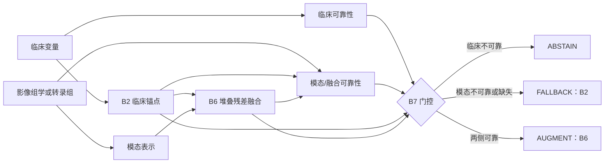
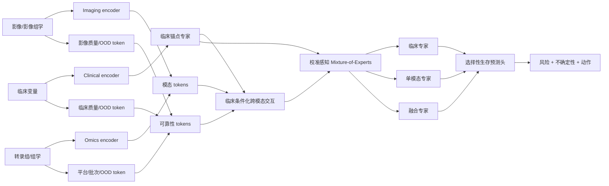

# TRUST-HN 实验结论总结与下一代多模态融合网络研究衔接

**版本日期：** 2026-08-12  
**文档性质：** 基于冻结实验结果的中文研究备忘录，用于衔接下一阶段“更好的多模态融合方法与网络框架”研究；不是论文正文，也不代表进入 WP4。  
**证据范围：** Phase 6 预设回顾性评价、Phase 5 压力测试/反证实验，以及明确标注为 **Phase 7 post hoc exploratory（事后探索性）** 的比较结果。Phase 8 不纳入本文档结论。

---

## 1. 整篇文章讲了什么

### 1.1 一句话科学结论

> 在异质性头颈癌数据生态中，多模态信息并非天然优于临床信息，其增量预后价值取决于队列、模态和平台转移条件。TRUST-HN 通过临床锚定、条件性增量融合以及可靠性感知的增强、回退和弃权，使多模态收益及其失败边界能够被审计；但现有回顾性证据不支持将其解释为跨生态统一获胜、普遍稳健、具有可部署阈值或已经建立临床效用的模型。

### 1.2 科学故事

本文不以“哪个模型在排行榜上最高”为中心，而围绕一个临床转化问题展开：

> **在已有临床信息的条件下，新增影像组学或转录组信息何时真正带来可信的增量预后价值；当新增模态失效时，模型能否识别错误增强，并回退到临床预测或拒绝输出？**

故事包含五个连续环节：

1. **建立临床锚点。** 临床变量通常更容易获得，也是评价新增模态是否真正有价值的必要参照。所有增量声明均相对于 B2 临床弹性网 Cox 锚点。
2. **检验强制融合的条件性收益。** B6 在临床锚点分数上加入附加模态表示。RADCURE 和 HANCOCK 给出有利点估计，说明多模态在部分生态中可能有价值。
3. **用跨平台失败反驳“模态越多越好”。** GSE65858 中转录组融合的绝对风险和校准明显恶化并劣于临床锚点，说明只观察 C-index 或 AUC 会掩盖过预测和不可迁移性。
4. **检验可靠性门控。** B7 能产生 AUGMENT、FALLBACK 和 ABSTAIN，但没有稳定优于 B6；在 GSE65858 的严重失败中仍将 92.6% 患者判为 AUGMENT，说明现有可靠性指标未充分识别语义错配和校准失败。
5. **用反证实验限制解释。** 压力测试、影像组学负对照、决策曲线和 Phase 7 事后探索性比较共同说明，良好的单队列表面性能不能直接解释为模态特异性生物信号、普遍稳健性、临床净获益或统一最佳模型。

因此，本文的核心贡献不是证明 TRUST-HN 是性能冠军，而是提出并实证检验一个更严格的原则：

> **多模态预后模型应以临床模型为锚点，评价条件性增量价值，并同时暴露增强、回退、弃权、覆盖率、校准和转移失败。**

---

## 2. 科学结论与实验验证链

| 科学结论 | 主要实验 | 支持的解释 | 不能外推的结论 |
|---|---|---|---|
| 多模态融合可在部分生态中提供有利增量点估计 | RADCURE 锁定测试；HANCOCK 回顾性 OOD 测试 | B6 相对 B2 的 Brier、Uno C 和 24 月 AUC 点估计较有利 | 不能称跨全部机构、平台和模态普遍优越 |
| 跨平台融合可能损害绝对风险预测 | GSE65858 转录组外部测试 | B6/B7 的 Brier 和校准显著差于 B2 | 不能只根据 C-index/AUC 宣称外部验证成功 |
| 门控能改变算法行为和选择性覆盖 | 四个 Phase 6 队列的动作分布 | B7 可输出 AUGMENT/FALLBACK/ABSTAIN，且动作比例随队列变化 | 动作不是临床决策；90% 配置不是安全阈值 |
| 现有门控没有稳定改善强制融合 | 相同非弃权子集的 B7−B6 配对 bootstrap | RADCURE 劣于 B6；HANCOCK 未建立优势；GSE65858 略改善 B6 但仍劣于 B2 | 不能用选择后的绝对 Brier 声称 B7 优于 B6 |
| 当前可靠性指标不能充分识别语义失败 | GSE65858 动作分布；Phase 5 行置换 | 严重失败仍大量 AUGMENT，语义错配后门控反应偏弱 | 不能称已检测所有分布偏移 |
| 影像组学表现不能直接解释为特异性生物信号 | RADCURE 打乱和随机化负对照 | 原始影像组学未明确优于对照 | 不能声称证明了特异性放射组学生物学 |
| 临床效用尚未建立 | 回顾性探索性决策曲线 | B7 相对 B6 无一致净获益优势 | 不能声称患者/治疗获益或可部署阈值 |
| 不存在跨生态统一最佳模型 | Phase 7 post hoc exploratory C1–C4 比较 | 方法排名随队列、模态和平台改变 | 不能将任何新增方法称为确认性通用赢家 |

---

## 3. 主要实验结果

### 3.1 RADCURE：锁定回顾性 CT 影像组学测试

**样本量：** `n=626`

| 模型 | IPCW Brier ↓ | Uno C ↑ | 24个月 AUC ↑ |
|---|---:|---:|---:|
| B2 临床锚点 | 0.1091 | 0.7078 | 0.7145 |
| B6 堆叠残差融合 | 0.0980 | 0.7740 | 0.7838 |
| B7 可靠性门控 | 0.0913 | 0.7567 | 0.7602 |

B6 相对 B2 显示更有利的回顾性点估计，提示该生态中的 CT 影像组学可能含有临床变量之外的增量预测信息。

B7 的非弃权覆盖率为 **93.3%**，实际评价 `n=584`。在相同非弃权子集上：

```text
B7 − B6 IPCW Brier = +0.00382
95% CI: +0.00084 至 +0.00718
```

Brier 越低越好，因此 B7 在相同患者上显著劣于 B6。B7 的原始绝对 Brier 较低部分来自选择性覆盖，不能据此声称门控优于 B6。

### 3.2 HANCOCK：回顾性 OOD 测试

**样本量：** `n=152`

| 模型 | IPCW Brier ↓ | Uno C ↑ | 24个月 AUC ↑ |
|---|---:|---:|---:|
| B2 临床锚点 | 0.1393 | 0.7476 | 0.7864 |
| B6 堆叠残差融合 | 0.1122 | 0.8281 | 0.8476 |
| B7 可靠性门控 | 0.1055 | 0.8249 | 0.8461 |

B6 再次给出有利点估计，但该证据仅限于预定义 HANCOCK OOD 分区。

B7 的非弃权覆盖率为 **82.9%**，实际评价 `n=126`：

```text
B7 − B6 IPCW Brier = +0.01058
95% CI: −0.00947 至 +0.03186
```

置信区间跨 0，未建立 B7 相对 B6 的优势。

### 3.3 GSE65858：跨平台转录组外部测试——关键失败边界

**样本量：** `n=244`

| 模型 | IPCW Brier ↓ | Uno C ↑ | 24个月 AUC ↑ |
|---|---:|---:|---:|
| B2 临床锚点 | 0.1964 | 0.5843 | 0.5893 |
| B6 堆叠残差融合 | 0.2725 | 0.6066 | 0.6035 |
| B7 可靠性门控 | 0.2672 | 0.5892 | 0.5839 |

校准结果：

```text
B6 calibration-in-the-large = −1.494
B6 calibration slope        =  0.599
B7 calibration-in-the-large = −1.548
B7 calibration slope        =  0.560
```

B6 的 Uno C/AUC 略高于 B2，但 Brier 明显恶化并出现严重校准失败。这说明患者排序略有改善不等于 24 个月绝对风险能够可靠转移。

B7 非弃权覆盖率为 **94.3%**，实际评价 `n=230`：

```text
B7 − B6 IPCW Brier = −0.00812
95% CI: −0.01584 至 −0.00183

B7 − B2 IPCW Brier = +0.07294
95% CI: +0.04250 至 +0.10389
```

B7 略微缓解 B6 的误差，但仍明显劣于临床锚点。与此同时，90% 主门控仍把 **92.6%** 患者分到 AUGMENT，说明当前门控没有充分识别跨平台失败。

### 3.4 GSE41613：受限 HPV 阴性 OSCC 敏感性分析

**样本量：** `n=97`

| 模型 | IPCW Brier ↓ | Uno C ↑ | 24个月 AUC ↑ |
|---|---:|---:|---:|
| B2 临床锚点 | 0.2674 | 0.5000 | 0.5000 |
| B6 堆叠残差融合 | 0.2742 | 0.6229 | 0.6377 |
| B7 可靠性门控 | 0.2611 | 0.6337 | 0.6555 |

B7 覆盖率为 **100.0%**。B6/B7 的辨别点估计较高，但 Brier 改善不确定。该队列只能作为小样本、限定 HPV 阴性 OSCC 的敏感性证据，不能称为一般 HNSCC 外部验证。

---

## 4. B7 动作分布及其启示

### 4.1 90% 主门控

| 队列 | AUGMENT | FALLBACK | ABSTAIN | 非弃权覆盖率 |
|---|---:|---:|---:|---:|
| RADCURE | 82.1% | 11.2% | 6.7% | 93.3% |
| HANCOCK | 64.5% | 18.4% | 17.1% | 82.9% |
| GSE65858 | 92.6% | 1.6% | 5.7% | 94.3% |
| GSE41613 | 95.9% | 4.1% | 0.0% | 100.0% |

动作分布证明 B7 可产生不同算法行为，但动作本身不等于正确动作。GSE65858 的严重校准失败与 92.6% AUGMENT 同时出现，是下一代方法最重要的设计线索。

### 4.2 为什么现有门控会漏检

当前可靠性组件主要测量样本是否远离开发分布、预测是否不稳定或不一致、模态是否缺失及模型对扰动是否敏感。这些信号可以发现“看起来不同”的数据，但跨平台失败不一定表现为简单的几何距离异常。样本可能仍处于熟悉的数值区域，却因平台映射、批次效应、特征语义变化、基线风险变化或模态—结局关系改变而产生系统性风险偏差。

下一代门控不仅要问：

> “这个输入离训练集有多远？”

还要问：

> “附加模态是否正在对临床锚点进行可信的风险修正；这种修正在当前平台、中心和患者亚群中是否保持方向、幅度和校准一致？”

---

## 5. 反证与边界实验

### 5.1 Phase 5 压力测试

- 8 项预设检查通过 7 项；
- HANCOCK 未通过 clean B7-vs-B6 Brier 非劣检查；
- 行置换降低 B6 性能，但 FALLBACK/ABSTAIN 仅弱增加，提示患者—模态语义错配检测不足；
- 两个 TCGA-HNSC 年龄 `≥65` 岁的探索性、种子级亚组结果超过 0.03 Brier-regret 警戒值。

这些结果不能证明真实部署中的安全性或对所有偏移的稳健识别。

### 5.2 RADCURE 影像组学负对照

```text
B6 original − shuffled IPCW Brier
= +0.00124 (95% CI −0.00105 至 +0.00334)

B6 original − randomized IPCW Brier
= +0.00063 (95% CI −0.00200 至 +0.00306)
```

置信区间均跨 0。该结果不证明影像组学完全无信息，但阻止把 RADCURE 的表现直接解释为已捕获特异性影像生物学机制。

### 5.3 回顾性探索性决策曲线

B7 相对 B6 没有一致净获益优势：RADCURE 和 HANCOCK 的全部评价阈值均低于 B6，GSE65858 的大多数阈值低于 B6。因此不能建立临床效用、患者获益、治疗获益或可部署阈值。

### 5.4 Phase 7 post hoc exploratory 比较

- C2 XGBoost-Cox 直接融合在 RADCURE 很强，Brier 约 0.0907；
- C2 在 HANCOCK 有竞争力，Brier 约 0.1037；
- C2 在 GSE65858 严重过预测，Brier 约 0.3429；
- C3 交叉拟合后期融合在 GSE65858 的 Brier 约 0.2050，优于 B6，但仍不及 B2 的 0.1964；
- C4 与 B5 数值相同，当前实现中显式缺失指示器未显示增益，但不能外推为所有缺失建模均无效。

模型复杂度或单队列优势不等于更好的跨生态可迁移性。

---

## 6. TRUST-HN 的创新方法和框架

### 6.1 创新定位

TRUST-HN 的创新不应局限为一个网络模块，而是三层科学与算法框架：

1. **临床锚定：** 复杂模态必须证明相对于临床模型的增量价值；
2. **条件性增量融合：** 学习附加模态对已有临床风险的条件性修正；
3. **可靠性门控选择性预测：** 当临床或附加模态不可靠时，不强迫模型始终输出融合风险，而是显式增强、回退或弃权。

### 6.2 B2：临床锚点

```text
临床变量 → 弹性网 Cox → 临床风险分数与24个月风险
```

B2 不是普通 baseline，而是所有增量价值判断的参照。临床锚点不被假定为永远最好，但复杂模态必须证明可信增益。

### 6.3 B6：堆叠残差融合

```text
交叉拟合的 B2 临床锚点分数 ─┐
                               ├→ 第二层弹性网 Cox → 增强风险
训练数据产生的附加模态表示 ──┘
```

其科学问题是：在临床风险已经被表示以后，附加模态还剩下多少可泛化预后信息？B6 不是固定系数 offset Cox，也不是原始高维特征简单拼接。

### 6.4 B7：可靠性门控选择性预测

临床侧组件：

- clinical OOD；
- clinical uncertainty；
- clinical model disagreement。

模态/融合侧组件：

- modality OOD；
- fusion uncertainty；
- perturbation sensitivity；
- modality missingness；
- fusion disagreement。

OOD 检测包含 Mahalanobis 距离、kNN 距离和 Isolation Forest 异常分数。组件按校准集经验百分位标准化并等权平均，阈值不使用外部测试结局优化。

```text
临床不可靠
    └→ ABSTAIN：不输出风险
临床可靠，但附加模态缺失或不可靠
    └→ FALLBACK：输出 B2
临床和附加模态均可靠
    └→ AUGMENT：输出 B6
```

优先级：`ABSTAIN > FALLBACK > AUGMENT`。

### 6.5 总体框架图



---

## 7. 现实中通常如何进行多模态融合

真实融合不仅是选择神经网络，还包括患者对齐、时间点统一、模态质控、特异预处理、缺失处理、表示融合、生存建模、校准、偏移检测和输出治理。

### 7.1 数据级/早期融合

```text
[x_clinical || x_radiomics || x_pathology || x_omics]
                         ↓
               单一生存预测模型
```

**常见实现：** 拼接后 Cox/弹性网 Cox、随机生存森林、梯度提升、XGBoost-Cox、MLP。

**优点：** 简单、易复现，可直接建模跨模态交互。  
**问题：** 高维模态容易支配临床变量；尺度、噪声和批次混合；缺失处理困难；容易学习平台或中心捷径。B5、C1 和 C2 属于此类。

### 7.2 表征级/中间融合

```text
Clinical encoder ──────┐
Imaging encoder ───────┼→ fusion module → survival head
Pathology encoder ─────┤
Omics encoder ─────────┘
```

融合模块可用拼接后 MLP、加权求和、门控单元、双线性/张量融合、co-attention、cross-attention、multimodal transformer、图神经网络、shared/private latent space、product/mixture of experts。

**优点：** 可学习丰富的跨模态关系，是新网络框架的主要探索空间。  
**问题：** 参数量和样本需求高；容易过拟合；注意力权重不等于可靠性或因果解释；完整模态训练后遇到缺失输入可能退化。

### 7.3 决策级/后期融合

```text
r_clinical ─┐
r_imaging ──┼→ 平均/加权/stacking/专家门控 → 最终风险
r_omics ────┘
```

常见方式包括简单平均、加权平均、stacking、贝叶斯模型平均、动态集成和 mixture-of-experts。

**优点：** 各模态可单独验证和校准；较容易支持缺失；隐私受限时可交换风险分数。  
**问题：** 深层交互较弱；基础模型都失准时，后期组合不会自动恢复可靠性。C3 属于此类。

### 7.4 混合/分层融合

按照生物或工作流层级逐步融合：

```text
病理区域 + 影像区域 → 肿瘤形态表征
肿瘤形态 + 转录组 → 分子—形态表征
分子—形态 + 临床锚点 → 最终生存风险
```

适合模态较多且层级关系明确的任务，但上游错误可能逐层传播。

### 7.5 临床锚点与残差/风险修正融合

```text
clinical anchor risk + modality-conditioned correction
                           ↓
                     augmented risk
```

可实现为 stacking、hazard correction、logit 风险残差、以临床风险为 query 的 cross-attention，或限幅的个体化风险增量。B6 属于此类，其优势是临床参照始终保留。

### 7.6 动态门控与 Mixture-of-Experts

```text
质量、缺失、OOD、不确定性 → gating network → w_c, w_i, w_o
risk = w_c r_clinical + w_i r_imaging + w_o r_omics
```

连续门控比 B7 的离散动作更细腻，但门控自身在 OOD 下也可能错误自信。

### 7.7 缺失模态鲁棒融合

现实中常见：

- 显式 modality mask；
- modality dropout；
- mask-aware attention；
- set-based fusion；
- partial-input encoders；
- teacher–student distillation；
- cross-modal reconstruction；
- 多重插补或生成式补全；
- 缺失时回退临床模型。

必须区分“模型能够运行”和“风险仍保持校准”。仅增加缺失指示器不一定足够；本项目 C4 与 B5 数值相同是局部阴性结果，但不能否定其他缺失鲁棒方法。

### 7.8 对比学习和跨模态对齐

可使用 patient-level contrastive learning、canonical correlation/deep CCA、shared/private representation、cross-modal prediction、masked multimodal modelling 和自监督预训练。风险是模型把医院、平台、批次或扫描协议当成患者语义进行对齐。

### 7.9 图结构融合

可以构造患者相似图、基因/通路图、病理区域图或异质患者—模态图。图构建必须局限于训练数据，避免测试患者邻接泄漏，并检查中心或平台依赖。

### 7.10 不确定性感知和选择性融合

常见方法有 deep/bootstrapped ensembles、Bayesian layers、Monte Carlo dropout、conformal prediction、selective prediction、risk–coverage optimization 和 calibrated abstention。B7 属于此方向，但现有结果表明统计 OOD 与不确定性不足以保证识别跨平台语义和校准失败。

---

## 8. 融合方式比较与 TRUST-HN 的位置

| 融合层级 | 代表结构 | 优点 | 局限 | 缺失适应性 | 跨平台风险 | 项目对应 |
|---|---|---|---|---|---|---|
| 早期融合 | 拼接 + Cox/MLP/XGBoost | 简单；直接交互 | 高维支配、过拟合、平台捷径 | 低至中 | 高 | B5、C1、C2 |
| 中间融合 | 编码器 + attention/transformer | 交互能力强 | 样本需求大、复杂、易错误自信 | 中 | 中至高 | 新框架主要空间 |
| 后期融合 | 单模态风险 + stacking | 易审计，较易支持缺失 | 深层交互有限 | 中至高 | 中 | C3 |
| 分层融合 | 模态内融合后逐层整合 | 符合生物层级 | 架构和验证复杂 | 中 | 中至高 | 多于两个模态时可用 |
| 锚点残差融合 | 临床风险 + 条件修正 | 检验增量价值；自然回退 | 修正仍可能跨平台失准 | 高 | 中 | B6；建议保留 |
| 动态专家融合 | gating + MoE | 个体化选择和连续权重 | 门控可能错误自信 | 高 | 中至高 | B7 的连续扩展 |
| 对比/潜空间融合 | 对比学习、shared/private | 利用无标签配对信息 | 易对齐批次捷径 | 中 | 中至高 | 可用于语义对齐 |
| 图融合 | GNN/异质图 | 引入结构先验 | 图泄漏和中心依赖 | 中 | 中至高 | 病理区域/通路场景 |
| 选择性融合 | 不确定性、conformal、abstention | 显式管理覆盖率 | 选择偏倚；阈值难迁移 | 高 | 取决于可靠性信号 | B7；仍会漏检 |

---

## 9. 现实多模态融合工作流

1. **患者级 ID 对齐：** 确认不同模态属于同一患者，禁止错配；
2. **统一索引时间和预测时点：** 明确基线日期、治疗状态及 24 月窗口；
3. **模态分别质控：** 检查影像协议/分割、病理质量、RNA 平台/批次和临床完整性；
4. **模态特异预处理：** 使用适合各模态的标准化、批次处理和编码；
5. **训练集内特征选择/降维：** 所有有监督步骤仅在训练折拟合；
6. **独立模态编码：** 生成患者级特征、token 或风险表示；
7. **建立可用性与质量 mask：** 记录缺失、质控、平台和中心来源；
8. **选择融合层级：** 根据样本量、缺失模式、隐私和部署约束选早期、中间、后期、分层或锚点融合；
9. **生存预测与绝对风险转换：** 输出明确时点风险，而不只输出排序分数；
10. **独立校准：** 在开发之外的校准数据确定基线风险和校准参数；
11. **OOD、语义一致性和不确定性评估：** 同时检测输入偏移、患者—模态对应关系、风险修正幅度和模型分歧；
12. **输出增强、回退、区间或弃权：** 避免所有患者被迫完整融合；
13. **外部评价：** 同时报告 Brier、校准、辨别力、coverage 和相同子集配对结果；
14. **持续监测：** 按中心、平台、时间、缺失模式和临床亚组监测漂移与最差组 regret。

由于模态不完整、采集时间不一致、隐私限制、平台差异和计算成本，现实中把所有原始数据直接送入一个端到端网络往往不现实。更可操作的是在各数据源内完成质控和编码，在患者级表示或风险级融合，保留临床锚点和单模态专家，并实施质量感知门控、外部校准和失败监测。

---

## 10. 下一阶段建议：临床锚点条件下的质量感知多专家网络

### 10.1 研究假设

> **若将临床锚点、模态质量、平台信息、语义一致性和风险修正幅度共同纳入融合过程，而不是只在末端用输入距离做离散门控，则可能在保留有利模态信息的同时减少跨平台错误增强，并在模态缺失或不可靠时平滑退化到临床锚点。**

### 10.2 概念框架



### 10.3 核心设计

#### A. 保留临床锚点

- 临床分支可独立输出；
- 融合风险表达为临床风险加受约束增量；
- 模态缺失或不可靠时自然退化到临床风险。

#### B. 模态专属编码器

- 临床：低维表格编码器或正则化生存模型；
- 影像组学：稀疏 MLP、特征组编码或区域图；
- 转录组：通路约束、稀疏自编码或 pathway token；
- 各编码器同时输出表示、质量分数和不确定性。

#### C. reliability token 进入融合过程

将模态缺失、采集平台/中心、输入与表示 OOD、预测不确定性、扰动敏感性、临床—模态风险冲突和风险修正幅度作为 token 或条件变量，使质量信息既决定是否使用模态，也控制融合权重与修正上限。

#### D. 校准感知多专家门控

至少保留：临床锚点专家、各单模态专家、临床+单模态专家、全模态专家和保守校准/限幅专家。

可考虑联合目标：

```text
L = L_survival
  + λ1 L_IPCW-Brier
  + λ2 L_calibration
  + λ3 L_anchor-regret
  + λ4 L_gate-consistency
  + λ5 L_selective-risk
```

`L_anchor-regret` 惩罚融合相对临床锚点的错误增强；`L_gate-consistency` 要求语义破坏或模态置换时融合权重下降。

#### E. 风险修正限幅

```text
risk_augmented = transform(risk_clinical, Δr)
Δr = bound(Δr_raw, reliability, platform_support)
```

可靠性低、平台缺乏支持或临床—模态冲突大时，让 `Δr` 收缩至 0，防止 GSE65858 型过度风险修正。

#### F. 缺失模态训练

使用 modality dropout、mask-aware 训练、临床锚点蒸馏约束及不同缺失机制下的校准损失，避免只在完整病例上训练后声称缺失鲁棒。

#### G. 选择性输出

输出可包括 24 月风险、风险区间/不确定性、专家权重、AUGMENT/FALLBACK/ABSTAIN、风险修正幅度及主要不可靠原因。它们仍是研究算法输出，不自动构成临床建议。

---

## 11. 下一阶段研究问题

1. **连续质量感知门控能否减少错误增强？** 比较离散 B7 和连续专家权重，重点评价跨平台错误增强率。
2. **语义一致性检测是否优于单纯输入 OOD？** 使用行置换、平台映射扰动、批次偏移和风险方向冲突进行压力测试。
3. **风险修正限幅能否改善跨平台校准？** 比较无约束、全局限幅、可靠性条件限幅和平台条件限幅。
4. **中间交互是否真正优于后期融合？** 在相同编码器和参数预算下比较早期拼接、cross-attention、late stacking、锚点残差和 MoE。
5. **模态缺失时模型能否保持校准？** 系统评价所有模态组合和缺失机制，而不只检查代码能否运行。
6. **可靠性信号能否预测融合比临床更差？** 将门控目标从一般 OOD 转向“错误增强事件”。

```text
错误增强事件 = 融合相对临床锚点增加预测损失
```

---

## 12. 推荐消融实验

| 消融 | 科学问题 | 主要指标 |
|---|---|---|
| 去掉临床锚点 | 临床锚定是否减少失败 | Brier、校准、anchor regret |
| 去掉 reliability token | 质量信息进入融合是否有益 | 错误增强率、OOD 性能 |
| 只用输入 OOD | 语义一致性的独立价值 | 行置换/平台扰动检出率 |
| 去掉风险修正限幅 | 限幅是否抑制过预测 | 跨平台校准失败 |
| 去掉 modality dropout | 缺失鲁棒是否来自训练策略 | 各缺失组合性能和校准 |
| 连续门控替换硬门控 | 连续权重是否优于阈值动作 | risk–coverage、错误增强率 |
| 去掉校准损失 | 校准目标是否必要 | Brier、校准斜率、C-index |
| 去掉单模态专家 | 专家多样性是否帮助退化 | 缺失/损坏场景表现 |
| 去掉平台/中心 token | 平台条件是否改善转移 | 跨平台 calibration regret |
| attention 替换为 stacking | 深层交互是否提供真实增益 | 外部结果与负对照差异 |

---

## 13. 推荐评价矩阵

### 13.1 比较模型

- B2 临床锚点；
- B5 早期直接融合；
- B6 堆叠残差融合；
- B7 当前可靠性门控；
- C3 Phase 7 post hoc exploratory 后期融合；
- 新质量感知多专家网络；
- 必要的单模态模型和简单平均。

### 13.2 指标

**预测：** IPCW Brier、Uno C、24 月 AUC、calibration-in-the-large、calibration slope。  
**选择性：** coverage、selective risk、risk–coverage 曲线、相同非弃权子集配对差值。  
**锚点退化：** mean/worst-group anchor regret、错误增强率、过度修正比例、回退后校准。  
**可靠性：** OOD 和语义错配 AUROC/AUPRC、不确定性—误差相关、置换后融合权重下降、错误增强识别能力。  
**现实鲁棒性：** 模态缺失、平台/中心转移、时间漂移、批次扰动、最差亚组 regret 和负对照敏感性。

### 13.3 治理要求

1. 使用新的嵌套开发/校准流程选择架构；
2. 不反复使用已公开的 Phase 6 测试结果选结构；
3. 保留真正未见的外部测试集；
4. 在相同患者、终点和 bootstrap 样本上配对比较；
5. 选择性模型同时报告 coverage 和相同非弃权子集结果；
6. 模型选择同时考虑 Brier、校准和最差组 regret，而非只看 C-index/AUC；
7. Phase 7 结果若用于设计启发，仍须标注 post hoc exploratory；
8. 新实验前注册主要假设、模型、终点和失败判据。

---

## 14. 新研究的最小可行路线

### 阶段 A：公平轻量基准

固定临床锚点，实现早期融合、后期融合、锚点残差融合和简单连续门控，在相同特征和参数预算下比较；暂不直接使用大型 transformer，避免把模型容量误当成融合创新。

### 阶段 B：质量和语义可靠性

加入 modality mask、平台/中心 token、输入 OOD 和预测分歧；建立行置换、批次扰动和跨平台校准压力测试；让门控直接识别错误增强。

### 阶段 C：中间交互和多专家

使用临床风险作为 query，模态表示和 reliability token 作为 key/value；通过 MoE 组合临床、单模态和融合专家；加入风险修正限幅与校准损失。

### 阶段 D：真正未见数据的锁定验证

冻结网络、阈值和校准，一次性评价绝对风险、校准、覆盖、错误增强和最差组 regret，同时报告成功和失败，不以测试结果继续回调模型。

---

## 15. 结语

TRUST-HN 为下一阶段提供的方向不是简单增加网络深度，而是：

1. 保留可独立工作的临床锚点；
2. 仅在附加模态提供可信条件信息时增强风险；
3. 检测几何 OOD 之外的语义错配、平台漂移和校准失败；
4. 在缺失或不可靠时平滑回退，而不是强制融合；
5. 用覆盖率、校准、临床锚点 regret 和负对照共同评价，而不只看 C-index/AUC。

推荐的下一代创新方向可概括为：

> **临床锚点条件下，融合质量与语义可靠性 token、风险修正限幅和校准感知 mixture-of-experts 的选择性多模态生存网络。**

该方向直接针对当前最关键的问题：**如何保留多模态在有利生态中的增量信息，同时避免 GSE65858 型跨平台错误增强。**

---

## 16. 项目内证据来源

- `project_management/argument_map.md`
- `project_management/paper_outline_zh-CN.md`
- `project_management/claim_matrix_zh-CN.md`
- `project_management/method_dictionary.csv`
- `docs/work_stage_reports/en/2026-08-08_phase6_report.md`
- `docs/work_stage_reports/en/2026-08-09_phase7_comparator_completion_report.md`
- `results/metrics/phase6/action_summary.csv`
- `configs/phase4_trust_hn.json`
- `src/trust_hn/models/residual_fusion.py`
- `src/trust_hn/reliability/gating.py`

第 7–14 节是面向下一阶段的技术路线归纳和研究设计建议，不是系统综述，也不表示这些建议已经在 TRUST-HN 中实现或验证。
