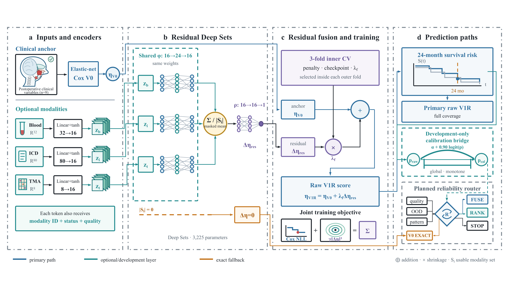

# External validation of clinically anchored multimodal survival prediction with incomplete evidence in head and neck cancer

> **Synced summary updated 1 October 2026.** The publication-facing source is `manuscript/pattern_surv_hn_springer_nature/main.tex`. Evidence now comprises repeated nested development cross-fitting, locked raw-V1R HANCOCK confirmation and independent two-centre retrospective external validation of frozen CAM/SCRF predictions. The calibration bridge remains development-only.

## Abstract

Multimodal prognostic models are often trained as if every recorded modality were simultaneously available and equally trustworthy. We developed PATTERN-Surv-HN, a clinically anchored framework for postoperative head and neck squamous cell carcinoma survival prediction in which usable blood, ICD and TMA measurements contribute through shrinkage-controlled residual fusion (SCRF) around a clinical anchor model (CAM). In 610 HANCOCK development patients with 173 deaths, repeated nested cross-fitting gave 100% coverage and improved mean 24-month Uno C from 0.644 to 0.666 and IPCW Brier score from 0.1247 to 0.1243. A locked HANCOCK cohort of 152 patients with 40 deaths showed concordant but uncertain point estimates. In an independent two-centre external cohort of 125 patients with 59 deaths, SCRF improved Uno C from 0.728 to 0.797 (difference +0.069, 95% CI 0.021 to 0.125), time-dependent AUC from 0.753 to 0.829 (difference +0.076, 0.025 to 0.134), Harrell C from 0.675 to 0.747 (difference +0.072, 0.040 to 0.106), and IPCW Brier score from 0.1215 to 0.1108 (difference -0.0106, -0.0185 to -0.0035). Both models retained complete coverage and exact empty-modality fallback. Calibration slope remained above one, supporting cohort-level recalibration and prospective utility evaluation before clinical use.

## Introduction

HNSCC outcomes reflect anatomy, tumour and nodal burden, HPV-related biology, smoking, pathology, treatment and host condition. Molecular, tissue and other measurements may add prognostic information, but their availability and reliability are uneven. Missingness is often generated by clinical acquisition rather than random masking, and a present measurement may still be internally incomplete, platform-shifted or shortcut-prone.

The clinically relevant question is therefore not whether a model can combine all recorded data, but whether optional evidence can safely modify a prediction that remains available when optional tests are absent. PATTERN-Surv-HN addresses this through a clinical anchor and a shrinkage-controlled residual set model. The anchor supplies a prediction for every eligible postoperative patient; optional blood, ICD and TMA evidence is encoded as an unordered set and is permitted to make only a controlled correction. The completed analyses separate development, locked HANCOCK confirmation, independent retrospective external validation and absolute-risk calibration.

## Results

**Figure 1 | Clinically anchored residual fusion architecture for PATTERN-Surv-HN.** **a**, Postoperative clinical-pathological variables are encoded by an elastic-net Cox clinical anchor (V0). **b**, Usable blood, ICD and TMA measurements are represented as unordered modality-specific tokens, each augmented with modality identity, availability/usability status and quality indicators, and processed by a shared permutation-invariant Deep Sets residual encoder. **c**, The residual estimate is shrinkage-controlled and added to the V0 anchor to produce the raw V1R score; residual penalty, optimization checkpoint and fold-specific residual scale are selected within inner cross-validation. **d**, The primary prediction path is raw V1R with full coverage. If no optional modality is usable, the residual is exactly zero and the model returns the V0 prediction. A global monotone calibration bridge is shown as a development-only layer and is not part of the primary locked readout. A reliability-routing module is shown as an optional exploratory concept rather than a validated deployment component.

### V0 provides a full-coverage clinical reference

The V0 clinical-pathological anchor used age, sex, smoking, primary site, grade, p16, resection, pathological T and pathological N. Adjuvant treatment and post-prediction variables were excluded. Under five repetition seeds, five outer folds and three inner folds, the anchor achieved mean IPCW Brier 0.124745, Uno C 0.644239, time-dependent AUC 0.662022 and Harrell C 0.623021 at 24 months. It supplied a prediction for every eligible development patient and remained the reference for residual learning and exact fallback.

### V1R improves discrimination while preserving full coverage

V1R retains the clinical anchor score and adds a shrinkage-controlled residual from the usable optional-modality set:

\[
\eta_{\mathrm{V1R},i}=\eta_{\mathrm{V0},i}+\lambda_f\Delta\eta_{\mathrm{res},i}.
\]

Here \(f\) indexes the outer cross-validation fold, \(\Delta\eta_{\mathrm{res},i}\) is the optional-modality residual, and \(\lambda_f\) is selected exclusively within that fold's inner cross-validation loop. Across five repetition seeds, mean Uno C improved by +0.021303 and was favourable in all five seeds. Mean AUC improved by +0.020488, IPCW Brier improved by -0.000407, and Harrell C improved by +0.010690.

| Model | IPCW Brier24 | Uno C24 | AUC24 | Harrell C | Coverage | Worst supported-pattern regret |
|---|---:|---:|---:|---:|---:|---:|
| Clinical anchor | 0.124745 | 0.644239 | 0.662022 | 0.623021 | 100% | reference |
| V1R residual fusion | 0.124338 | 0.665542 | 0.682511 | 0.633710 | 100% | +0.009848 |

The gain was not obtained by deleting difficult patients. Both models covered all 610 eligible development patients. For an empty optional-modality set, the residual and fused-score fallback errors were both 0.0. The worst supported-pattern Brier regret was +0.009848, below the +0.020 no-harm boundary.

### A rank-preserving development bridge improves the V1R risk scale

The raw V1R score showed mild under-dispersion in the development absolute-risk diagnostic: the calibration slope was 0.825887 and CITL was +0.011680. We therefore evaluated a separate, globally monotone bridge rather than changing the V1R backbone or introducing a pattern-specific router. For raw 24-month risk \(p_{\mathrm{V1R}}\), the selected U5R7 bridge was

\[
x_{\mathrm{raw}}=\operatorname{logit}(p_{\mathrm{V1R}}),
\]

\[
x_{\mathrm{bridge}}=\alpha_{\mathrm{logloss},f}+0.90x_{\mathrm{raw}},
\qquad
p_{\mathrm{bridge}}=\sigma(x_{\mathrm{bridge}}).
\]

The intercept was fitted by weighted log-loss using only non-held-out development folds for each held-out fold. Because the slope was positive and global, the transformation was strictly monotone and preserved ranking in every held-out fold. The bridge-evaluable diagnostic comprised 2,460 repeated OOF rows and 415 evaluable events; these rows are an absolute-risk calibration estimand and are not substituted for the primary V0-versus-V1R performance table.

| Metric | Raw V1R | U5R7 bridge | Change | Interpretation |
|---|---:|---:|---:|---|
| IPCW Brier24 | 0.126637 | 0.126784 | +0.000147 | small development penalty; within +0.0005 gate |
| CITL | +0.011680 | -0.003796 | -0.015477 | absolute error improved by 0.007884 |
| Calibration slope | 0.825887 | 0.881552 | +0.055665 | absolute error to 1 improved by 0.055665 |
| Worst supported-pattern Brier regret | ? | +0.004176 | ? | below +0.005 gate |
| Coverage | 100% | 100% | 0 | preserved |
| Ranking | reference | preserved | ? | all held-out folds |

Thus, U5R7 provided a conservative development calibration stabilization: CITL moved closer to zero and the slope moved closer to one, with only a small Brier penalty and no loss of coverage or ranking. This remains a development-only bridge result. In U5R8, a fixed development-derived intercept and beta=0.90 were applied without confirmation tuning in a locked secondary post-unseal validation of the 152-patient HANCOCK OOD cohort. The bridge preserved 100% coverage and exact ranking, but IPCW Brier24 worsened by +0.001085, CITL absolute error worsened by +0.004194, and calibration-slope absolute error worsened by +0.167815. Thus the calibration improvement did not transport to this cohort and the bridge is not a confirmed calibration layer.

### Locked outcome-untouched confirmation shows the same favourable raw-V1R direction

After the V1R protocol, model specification, inputs and pre-unseal predictions had been frozen and sealed, the locked confirmation evaluation was conducted in the HANCOCK OOD cohort. This cohort included 152 patients and 40 events, with 100% coverage and a supported acquisition pattern of `111` for the full cohort. The primary confirmation readout used raw V1R, not the development bridge. V1R showed favourable point estimates across discrimination and probabilistic accuracy metrics:

| Metric at 24 months | Clinical anchor | Raw V1R | Raw V1R minus anchor | Favourable direction |
|---|---:|---:|---:|---|
| Uno C | 0.782579 | 0.804242 | +0.021664 | higher |
| IPCW Brier | 0.136412 | 0.131246 | -0.005166 | lower |
| Time-dependent AUC | 0.801094 | 0.813637 | +0.012543 | higher |
| Harrell C | 0.733253 | 0.752842 | +0.019589 | higher |
| Calibration-in-the-large | 0.211270 | 0.116482 | -0.094788 | closer to 0 |
| Calibration slope | 1.945126 | 1.501223 | -0.443903 | closer to 1 |
| Coverage | 100% | 100% | 0 | preserved |

The confirmation result is interpreted as a positive directional signal at the prespecified point-estimate level. Patient-level stratified bootstrap intervals crossed zero for delta Uno C (mean +0.021654; 95% interval -0.025965 to +0.070816) and delta IPCW Brier (mean -0.005222; 95% interval -0.012843 to +0.002171). Accordingly, confirmation supports consistency of raw-V1R direction but does not establish definitive superiority. U5R8 subsequently evaluated the frozen bridge after the raw confirmation outcome unsealing; because Brier, CITL and slope safety criteria failed despite preserved ranking and coverage, the bridge contributes no confirmed calibration claim.

### Independent two-centre external validation confirms incremental value

Frozen CAM and SCRF predictions were evaluated without refitting in an independent private cohort of 125 postoperative patients from two pseudonymized centres. The cohort included 59 observed deaths and 19 deaths by 24 months; median observed follow-up was 1,339 days. Both models had 100% coverage across all eight blood-ICD-TMA usability patterns.

| Metric | CAM | SCRF | Difference | Paired bootstrap 95% CI |
|---|---:|---:|---:|---:|
| IPCW Brier at 24 months | 0.121450 | 0.110822 | -0.010628 | -0.018537 to -0.003465 |
| Uno C at 24 months | 0.727700 | 0.796615 | +0.068915 | +0.020752 to +0.124547 |
| Time-dependent AUC at 24 months | 0.752898 | 0.829089 | +0.076192 | +0.024772 to +0.133700 |
| Harrell C | 0.674562 | 0.746566 | +0.072004 | +0.039998 to +0.105636 |
| Calibration-in-the-large | +0.020932 | -0.009730 | -0.030661 | -- |
| Calibration slope | 1.249521 | 1.507270 | +0.257749 | -- |
| Coverage | 100% | 100% | 0 | -- |

Every paired performance interval excluded the null in the favourable direction. The sole patient with no usable optional modality received the CAM score and risk exactly. Only pattern `111` met the prespecified support threshold; its Brier change was -0.005034. Calibration slope remained above one, so the result supports transported incremental performance but not direct use of unadjusted absolute risks.

### Exploratory extensions do not alter the confirmation boundary

Two additional analyses were performed as explicitly exploratory extensions and are reported separately from the core confirmation claim. First, a patient-level cross-fitted value router that selects raw V1R (FUSE) or V0 (FALLBACK) was evaluated on development repeated OOF predictions. Its best point estimate (reliability-augmented, threshold 0.60) reduced IPCW Brier24 versus V0 by 0.000506, but the 2,000-replicate bootstrap interval crossed zero and the router remained worse than direct raw V1R while not preserving exact global ranking. Second, an external characterization on the RADCURE held-out test split (626 patients, 110 events) described transportability of an adapted clinical/radiomics comparator set, with full coverage and generally strong discrimination. Because RADCURE does not reproduce the frozen current-V1R blood/ICD/TMA contract and its outcome was previously consumed, this is descriptive characterization, not external validation of current V1R. Neither analysis changes the primary raw-V1R confirmation boundary.

## Discussion

The central finding is that controlled residual fusion retained incremental prognostic value outside the HANCOCK development ecosystem. Development gains were consistent across five repetitions, the locked HANCOCK cohort showed the same direction, and the independent two-centre cohort produced paired intervals excluding the null for Brier score and all discrimination measures. The external result retained complete coverage across heterogeneous modality patterns and exact fallback when no optional modality was usable.

Absolute-risk transport was less complete. External calibration-in-the-large was close to zero, but the SCRF calibration slope was 1.507. The fixed development bridge had also failed to transport in the locked secondary HANCOCK analysis. A future implementation should therefore prespecify site-level recalibration before communicating individual probabilities, without changing the externally validated ranking result.

The external cohort was retrospective and included only 19 deaths by 24 months. Centre names, ethics approval and data-sharing language remain to be added, and the transfer package did not include a timestamped prediction-seal receipt. This cohort is therefore labelled independent retrospective external validation rather than a second outcome-untouched confirmation. Rare modality patterns, decision-curve benefit, clinical utility and prospective workflow effects remain unresolved.

## Methods

### Cohorts and endpoint

The development analysis used 610 eligible HANCOCK postoperative patients and 173 deaths. The locked confirmation cohort contained 152 eligible patients and 40 deaths. The independent external validation cohort contained 125 eligible postoperative patients from two pseudonymized centres and 59 deaths. Overall survival was measured from first treatment to last information, with a primary horizon of 730.5 days. The clinical anchor used variables available after definitive surgery and pathology review and before downstream treatment/outcome information.

### V1R architecture

Each usable modality is encoded as a token with modality identity, usability/status and quality features. Tokens are pooled by a permutation-invariant masked-mean Deep Sets encoder. For patient \(i\),

\[
\eta_{\mathrm{V1R},i}=\eta_{\mathrm{V0},i}+\lambda_f g\left(\rho\left(\frac{1}{|S_i|}\sum_{m\in S_i}\phi(x_{im},q_{im},e_m)\right)\right),
\]

where \(S_i\) is the set of usable optional modalities, \(x_{im}\) contains modality values, \(q_{im}\) contains quality and availability features, and \(e_m\) is a modality embedding. The model has 3,225 parameters. For each outer fold \(f\), the residual penalty, optimisation checkpoint and \(\lambda_f\) were selected within the corresponding three-fold inner cross-validation from penalties {0.01, 0.1, 1.0}, checkpoints {0, 10, 25, 50} and scales {0.1, 0.2, 0.3, 0.4, 0.5, 1.0}. All preprocessing and baseline-hazard estimation were fold-bound. When \(S_i\) was empty, the residual was exactly zero and the output equalled V0.

### Development calibration bridge

The bridge was frozen as the U5R7 candidate `beta_0.900_logloss` after the U5R5 fixed-slope and U5R6 intercept-objective exploration. It is not a new prediction backbone. For each held-out outer fold \(f\), the raw V1R 24-month risk was transformed by

\[
x_{\mathrm{raw},i}=\operatorname{logit}(p_{\mathrm{V1R},i}),
\]

\[
x_{\mathrm{bridge},i}=\alpha_{\mathrm{logloss},f}+0.90x_{\mathrm{raw},i},
\qquad p_{\mathrm{bridge},i}=\sigma(x_{\mathrm{bridge},i}).
\]

The intercept \(\alpha_{\mathrm{logloss},f}\) was fitted using weighted log-loss on non-held-out development folds only. The bridge was global-only, used no pattern-specific adjustments, and had a fixed positive slope. Hence it was strictly monotone, preserved ranking, retained 100% coverage, and did not alter the exact V0 fallback when the optional set was empty. The bridge diagnostic used 5 repetition seeds, 5 outer folds, 2,460 IPCW-evaluable rows and 415 evaluable events. Confirmation outcomes were not used for fitting or tuning of this bridge. U5R8 evaluated the frozen bridge only after the raw U2 confirmation outcomes had been unsealed, so that readout is explicitly secondary post-unseal validation rather than pristine confirmation.

### Locked confirmation protocol

The confirmation protocol, input manifest, dependency lock and prediction artifact were frozen before confirmation outcomes were unsealed. Twenty-five matched V0/V1R members were generated using five repetition seeds and five outer folds, with development-fold fitting only and no confirmation-cohort tuning, calibration bridge, router, refitting or selective patient removal. Confirmation outcomes were read only after prediction sealing. Aggregate metrics were evaluated with the prespecified estimands and patient-level stratified bootstrap (2,000 replicates; seed 20260825) for uncertainty intervals. The primary confirmation results are for raw V1R. U5R8 separately applied the already frozen beta=0.90 bridge with the arithmetic mean of the 25 development intercepts (alpha=-0.14503379856995471), using 2,000 event-stratified bootstrap replicates (seed 20260827); no confirmation outcome was used for parameter selection.

### Independent external validation protocol

The external workbook contained separate cohort, modality, prediction and outcome tables. Patient identifiers were unique and aligned one-to-one, all required clinical predictors and predictions were complete, and chronology checks passed. Frozen 25-member CAM and SCRF predictions were evaluated without refitting, recalibration, threshold selection or patient exclusion. Point estimates were independently recomputed and matched the workbook to absolute tolerance 1e-12. The workbook supplied paired patient-level percentile intervals from 2,000 bootstrap replicates. The input workbook SHA256 was `9341150581FBF3805D4A7F39C2FEB43A419E12DE2CC7CC5C6ED238E28261A281`.

### Estimands and reproducibility

The paired development estimands were

\[
\Delta\mathrm{Brier}_{24}=\mathrm{Brier}_{24}(\mathrm{V1R})-\mathrm{Brier}_{24}(\mathrm{V0}),
\]

and

\[
\Delta\mathrm{UnoC}_{24}=\mathrm{UnoC}_{24}(\mathrm{V1R})-\mathrm{UnoC}_{24}(\mathrm{V0}).
\]

For the bridge diagnostic, the calibration summaries were compared between raw V1R and the bridged risk. CITL is better when closer to 0, and calibration slope is better when closer to 1. The bridge safety estimands were the global IPCW-Brier change and the largest excess Brier score among supported acquisition patterns:

\[
\mathcal{R}_{\mathrm{worst}}=\max_{p\in\mathcal{P}_{\mathrm{supported}}}
\{\mathrm{Brier}_{24}(\mathrm{bridge},p)-\mathrm{Brier}_{24}(\mathrm{V1R},p)\},
\]

where supported patterns required at least 30 patients and 10 events. The U5R7 development gates were a global Brier delta no greater than +0.0005, worst supported-pattern regret no greater than +0.005, CITL improvement, slope improvement, and ranking preservation.

Lower Brier and positive discrimination differences favour V1R; calibration-in-the-large is better when closer to 0 and calibration slope is better when closer to 1. The formal development OOF SHA256 was `E43BB6C0D8E2C7F9C8B22A9C416AD752109B926A8526273D88811458CD73BCE0`. The locked confirmation protocol SHA256 was `1E134D30557D1CC153997F6EBB79E99C2E160F85A9F94BF3BBDD81C2C588BDED`, the sealed prediction artifact SHA256 was `E5DA83BDB3BB97C3488687C78CCF166FBD03059619DD0690E2767CAF8F393FCF`, and the private external workbook SHA256 was `9341150581FBF3805D4A7F39C2FEB43A419E12DE2CC7CC5C6ED238E28261A281`. Patient-level predictions remain outside version control.

## Figure assets

Figure 1 uses the author-provided editable artwork and is available in publication-facing formats:

- Editable source: `figures/figure1_pattern_surv_hn_framework.pptx`
- Vector export: `figures/figure1_pattern_surv_hn_framework.pdf`
- Raster export: `figures/figure1_pattern_surv_hn_framework.png`

The publication-facing Springer Nature manuscript contains Figures 1--6, including the independent external-validation summary generated from aggregate artifacts.

## Data and code availability

The repository stores aggregate metrics, frozen specifications and audits. The publication-facing source of truth is `manuscript/pattern_surv_hn_springer_nature/main.tex`. Private external patient-level data and predictions remain outside version control. Participating-institution names, ethics wording, data-access conditions, author metadata and final archive details remain to be completed.
